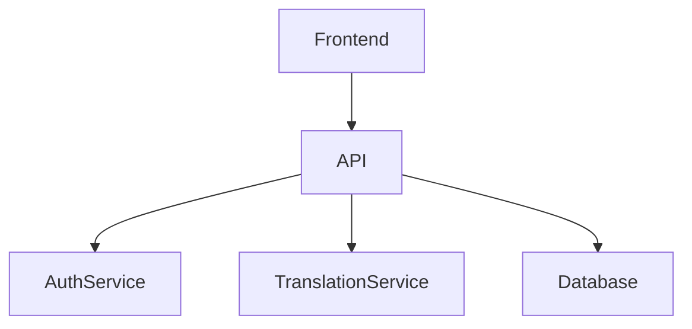
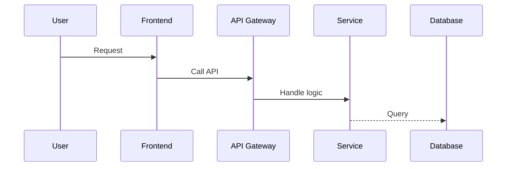
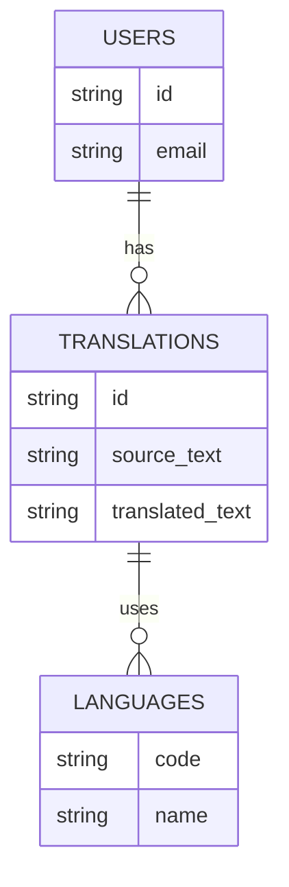

# Documentation Guidelines

## File Naming
- Use kebab-case for all filenames: `my-file-name.md`

## Structure Template
All documentation files must begin with:

```md
## Purpose  
## Scope  
## Dependencies  
## See Also
```

## Titles
Use a level 1 heading (#) as the first line with the document title.

## Internal Links
Use relative paths like [security.md](../development/security.md).

## Diagrams
Use Mermaid where relevant. Prefer:

- `graph TD` for flows
- `sequenceDiagram` for API exchanges
- `erDiagram` for data models

## Examples

### Flow Diagram


### Sequence Diagram


### Entity Relationship Diagram


## Best Practices

1. Keep documentation up to date with code changes
2. Use clear and concise language
3. Include examples where appropriate
4. Cross-reference related documentation
5. Add diagrams to illustrate complex concepts
6. Use consistent formatting throughout
7. Include code snippets with proper syntax highlighting
8. Add a Table of Contents for long documents
9. Keep paragraphs short and focused
10. Use lists for better readability

## Support

For documentation questions:
- Check the [Contributing Guidelines](docs/contributing/contributing.md)
- Review the [Code Structure](docs/development/code-structure.md)
- Contact the documentation team 