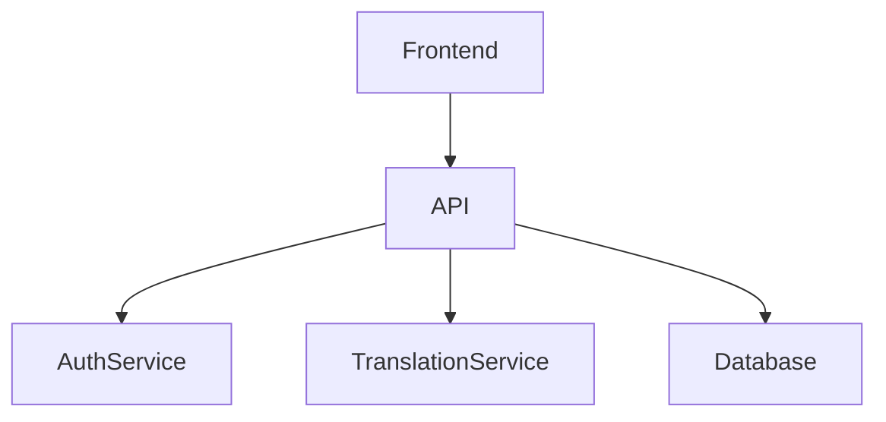
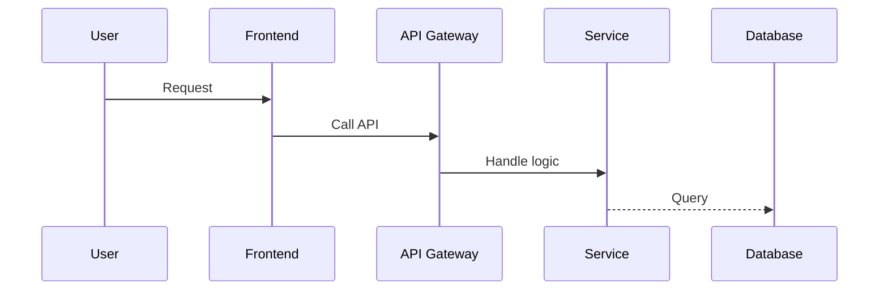
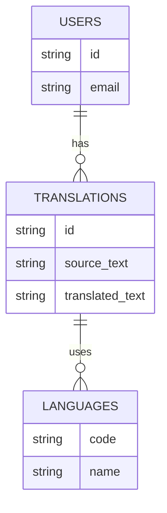

# Documentation Guidelines

## Purpose
_Define standards and guidelines for maintaining consistent documentation across Project Babel._

## Scope
_This document covers documentation structure, formatting, and maintenance guidelines._

## Dependencies
- [docs/contributing/contributing.md](docs/contributing/contributing.md)
- [docs/development/code-structure.md](docs/development/code-structure.md)

## See Also
- [Contributing Guide](docs/contributing/contributing.md) - General contribution guidelines
- [Code Structure](docs/development/code-structure.md) - Code organization
- [API Overview](docs/api/api-overview.md) - API documentation
- [Development Guidelines](docs/development/guidelines.md) - Development standards

## Scope Clarification

All documentation should assume the application is API-only.  
There is no front-end for users. Documentation should focus on:
- API architecture
- Endpoints
- Authentication and security
- Caching, performance, and monitoring
- Admin/technical interface only if relevant

## Structure Template

Each documentation file should follow this structure:

```markdown
# Title

## Purpose
_Brief description of the document's purpose._

## Scope
_What this document covers and what it doesn't._

## Dependencies
- List of related documentation files
- Links to external resources if applicable

## See Also
- Related documentation sections
- Cross-references to other relevant documents

## Table of Contents
- [Section 1](#section-1)
- [Section 2](#section-2)
...

## Section 1
Content...

## Section 2
Content...
```

## Formatting Guidelines

### Headers
- Use H1 (#) for document title only
- Use H2 (##) for major sections
- Use H3 (###) for subsections
- Use H4 (####) for detailed subsections

### Code Blocks
- Use triple backticks with language specification
- Include file path in code block header
- Example:
```php
// src/Controller/ApiController.php
public function index(): Response
{
    return $this->json(['message' => 'Hello API']);
}
```

### Links
- Use relative paths for internal documentation
- Use descriptive link text
- Include brief descriptions in parentheses
- Example: [API Overview](docs/api/api-overview.md) (API documentation)

### Lists
- Use unordered lists for general items
- Use ordered lists for sequential steps
- Use nested lists for hierarchical information

### Tables
- Use tables for structured data
- Include headers for all columns
- Align content appropriately

### Images
- Use descriptive alt text
- Include captions when needed
- Store images in appropriate directories
- Use relative paths for image references

## Content Guidelines

### API Documentation
- Document all endpoints
- Include request/response examples
- Specify authentication requirements
- Document rate limiting
- Include error responses

### Code Documentation
- Document public methods
- Include parameter descriptions
- Document return types
- Include usage examples
- Document exceptions

### Architecture Documentation
- Include system diagrams
- Document component interactions
- Specify data flow
- Document security measures
- Include scaling considerations

### Development Guidelines
- Document setup procedures
- Include troubleshooting steps
- Document testing procedures
- Include deployment guidelines
- Document monitoring setup

## Maintenance Guidelines

### Version Control
- Keep documentation in version control
- Review documentation changes
- Update documentation with code changes
- Maintain changelog

### Review Process
- Review documentation changes
- Ensure technical accuracy
- Check formatting consistency
- Verify links and references
- Update related documentation

### Regular Updates
- Review documentation quarterly
- Update outdated information
- Add missing documentation
- Remove obsolete content
- Update examples and code snippets

## Support

For questions about documentation:
- Check existing guidelines
- Consult the team
- Review similar documentation
- Update guidelines if needed

## File Naming
- Use kebab-case for all filenames: `my-file-name.md`

## Titles
Use a level 1 heading (#) as the first line with the document title.

## Internal Links
Use relative paths like [security.md](../development/security.md).

## Diagrams
Use Mermaid where relevant. Prefer:

- `graph TD` for flows
- `sequenceDiagram` for API exchanges
- `erDiagram` for data models

## Examples

### Flow Diagram


### Sequence Diagram


### Entity Relationship Diagram


## Best Practices

1. Keep documentation up to date with code changes
2. Use clear and concise language
3. Include examples where appropriate
4. Cross-reference related documentation
5. Add diagrams to illustrate complex concepts
6. Use consistent formatting throughout
7. Include code snippets with proper syntax highlighting
8. Add a Table of Contents for long documents
9. Keep paragraphs short and focused
10. Use lists for better readability 