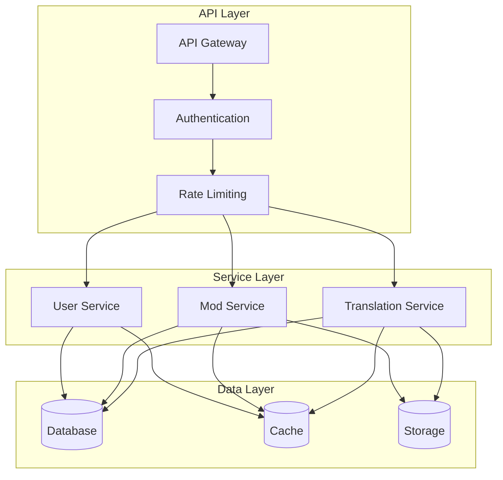

# API Overview

## Purpose
_Describe the overall API structure, endpoints, and integration guidelines for Project Babel._

## Scope
_This document covers the API architecture, endpoints, authentication, and integration patterns._

## Dependencies
- [authentication.md](authentication.md)
- [error-handling.md](error-handling.md)
- [rate-limiting.md](rate-limiting.md)

## See Also
- [endpoints.md](endpoints.md) - Detailed API endpoint documentation
- [caching.md](caching.md) - API caching strategies
- [error-handling.md](error-handling.md) - API error handling patterns
- [system-architecture.md](../architecture/system-architecture.md) - System architecture
- [component-architecture.md](../architecture/component-architecture.md) - Component design
- [security-architecture.md](../architecture/security-architecture.md) - Security implementation

## Overview

The API is designed to provide a robust and scalable interface for the translation system.



## API Design

### 1. RESTful Principles
- Resource-based URLs
- HTTP methods
- Status codes
- Versioning

### 2. API Versioning
- URL versioning
- Header versioning
- Deprecation policy
- Migration guide

## Authentication

### 1. Authentication Methods
- JWT tokens
- OAuth2
- API keys
- Session management

### 2. Authorization
- Role-based access
- Resource permissions
- API scopes
- Rate limits

## Endpoints

### 1. Translation Endpoints
```yaml
/api/v1/translations:
  get:
    description: List translations
    parameters:
      - name: page
        type: integer
        required: false
      - name: limit
        type: integer
        required: false
      - name: status
        type: string
        required: false
    responses:
      200:
        description: Success
      401:
        description: Unauthorized
      403:
        description: Forbidden

  post:
    description: Create translation
    parameters:
      - name: source_text
        type: string
        required: true
      - name: target_language
        type: string
        required: true
    responses:
      201:
        description: Created
      400:
        description: Bad Request
```

### 2. Mod Endpoints
```yaml
/api/v1/mods:
  get:
    description: List mods
    parameters:
      - name: game_id
        type: string
        required: false
      - name: status
        type: string
        required: false
    responses:
      200:
        description: Success
      401:
        description: Unauthorized

  post:
    description: Create mod
    parameters:
      - name: name
        type: string
        required: true
      - name: description
        type: string
        required: true
      - name: game_id
        type: string
        required: true
    responses:
      201:
        description: Created
      400:
        description: Bad Request
```

## Request/Response

### 1. Request Format
```json
{
  "source_text": "Hello, world!",
  "target_language": "fr",
  "context": {
    "game_id": "game123",
    "mod_id": "mod456"
  }
}
```

### 2. Response Format
```json
{
  "id": "trans123",
  "source_text": "Hello, world!",
  "target_text": "Bonjour, monde!",
  "status": "completed",
  "created_at": "2024-03-28T10:00:00Z",
  "updated_at": "2024-03-28T10:01:00Z"
}
```

## Error Handling

### 1. Error Format
```json
{
  "error": {
    "code": "VALIDATION_ERROR",
    "message": "Invalid input data",
    "details": {
      "field": "source_text",
      "message": "Text cannot be empty"
    }
  }
}
```

### 2. Status Codes
- 200: Success
- 201: Created
- 400: Bad Request
- 401: Unauthorized
- 403: Forbidden
- 404: Not Found
- 429: Too Many Requests
- 500: Internal Server Error

## Rate Limiting

### 1. Limits
- Per user
- Per IP
- Per endpoint
- Per service

### 2. Headers
```
X-RateLimit-Limit: 100
X-RateLimit-Remaining: 95
X-RateLimit-Reset: 1616789012
```

## Caching

### 1. Cache Strategy
- Response caching
- Cache invalidation
- Cache headers
- Cache control

### 2. Cache Headers
```
Cache-Control: public, max-age=3600
ETag: "33a64df551425fcc55e4d42a148795d9f25f89d4"
```

## Monitoring

### 1. Metrics
- Response time
- Error rate
- Request count
- Cache hit rate

### 2. Logging
- Request logs
- Error logs
- Access logs
- Performance logs

## Documentation

### 1. API Documentation
- OpenAPI/Swagger
- Postman collection
- Example requests
- Example responses

### 2. Integration Guide
- Authentication
- Rate limiting
- Error handling
- Best practices

## Testing

### 1. API Tests
- Unit tests
- Integration tests
- Load tests
- Security tests

### 2. Test Environment
- Mock data
- Test endpoints
- Test credentials
- Test documentation 