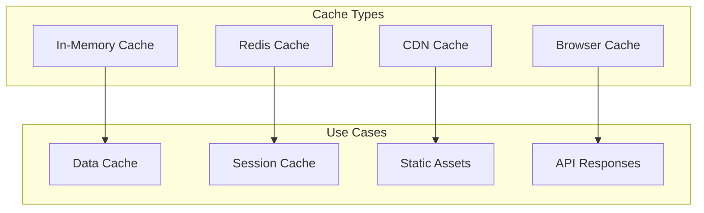

# API Caching

## Purpose
_Describe the caching mechanisms, strategies, and implementation details._

## Scope
_This document concerns the technical implementation of caching in the API._

## Dependencies
- [api-overview.md](api-overview.md)
- [rate-limiting.md](rate-limiting.md)
- [error-handling.md](error-handling.md)

## See Also
- [api-overview.md](api-overview.md) - API architecture
- [rate-limiting.md](rate-limiting.md) - Rate limiting
- [error-handling.md](error-handling.md) - Error handling
- [caching-strategy.md](../architecture/caching-strategy.md) - Architectural caching decisions
- [API Overview](api-overview.md) - General API documentation

## Overview

This document describes how caching is exposed and consumed through the API layer of Project Babel. It focuses on the client-facing aspects of caching, including cache headers, response formats, and client-side caching strategies. This document complements the architectural caching strategy described in [caching-strategy.md](../architecture/caching-strategy.md), which covers the internal caching layers and implementation details.

## Caching Strategy

### 1. Cache Types


### 2. Cache Headers
```
Cache-Control: public, max-age=3600
ETag: "33a64df551425fcc55e4d42aec795d9a25b21c82"
Last-Modified: Wed, 28 Mar 2024 10:00:00 GMT
```

## Cache Implementation

### 1. Cache Service
```php
class CacheService
{
    public function get(string $key, callable $callback, int $ttl = 3600): mixed
    {
        $value = $this->redis->get($key);
        
        if ($value === null) {
            $value = $callback();
            $this->redis->setex($key, $ttl, serialize($value));
        } else {
            $value = unserialize($value);
        }
        
        return $value;
    }
}
```

### 2. Cache Middleware
```php
class CacheMiddleware
{
    public function handle(Request $request, Closure $next): Response
    {
        if (!$this->shouldCache($request)) {
            return $next($request);
        }

        $key = $this->generateCacheKey($request);
        $response = $this->cache->get($key, function() use ($next, $request) {
            return $next($request);
        });

        return $this->addCacheHeaders($response);
    }
}
```

## Cache Keys

### 1. Key Generation
```php
class CacheKeyGenerator
{
    public function generateKey(Request $request): string
    {
        $parts = [
            'cache',
            $request->method(),
            $request->path(),
            md5(json_encode($request->query()))
        ];
        
        return implode(':', $parts);
    }
}
```

### 2. Key Types
- Resource keys
- Query keys
- User-specific keys
- Session keys

## Cache Policies

### 1. Cache Invalidation
```php
class CacheInvalidator
{
    public function invalidate(string $pattern): void
    {
        $keys = $this->redis->keys($pattern);
        foreach ($keys as $key) {
            $this->redis->del($key);
        }
    }
}
```

### 2. Cache Tags
```php
class TaggedCache
{
    public function tags(array $tags): self
    {
        $this->tags = $tags;
        return $this;
    }

    public function flush(): void
    {
        foreach ($this->tags as $tag) {
            $this->invalidateByTag($tag);
        }
    }
}
```

## Cache Levels

### 1. Application Cache
- In-memory cache
- Redis cache
- Database cache

### 2. CDN Cache
- Static assets
- API responses
- Media files

## Cache Headers

### 1. Response Headers
```
Cache-Control: public, max-age=3600, stale-while-revalidate=60
ETag: "33a64df551425fcc55e4d42aec795d9a25b21c82"
Last-Modified: Wed, 28 Mar 2024 10:00:00 GMT
Vary: Accept-Encoding, User-Agent
```

### 2. Cache Control Directives
- public
- private
- no-cache
- no-store
- must-revalidate
- proxy-revalidate
- max-age
- s-maxage

## Cache Patterns

### 1. Cache-Aside
```php
class CacheAside
{
    public function get(string $key): mixed
    {
        $value = $this->cache->get($key);
        
        if ($value === null) {
            $value = $this->database->get($key);
            $this->cache->set($key, $value);
        }
        
        return $value;
    }
}
```

### 2. Write-Through
```php
class WriteThrough
{
    public function set(string $key, mixed $value): void
    {
        $this->database->set($key, $value);
        $this->cache->set($key, $value);
    }
}
```

## Monitoring

### 1. Cache Metrics
- Hit rate
- Miss rate
- Memory usage
- Eviction rate

### 2. Cache Logging
```json
{
  "timestamp": "2024-03-28T10:00:00Z",
  "event": "CACHE_MISS",
  "key": "cache:GET:/api/v1/translations",
  "ttl": 3600,
  "size": 1024,
  "tags": ["translations"]
}
```

## Best Practices

### 1. Cache Guidelines
- Set appropriate TTLs
- Use cache tags
- Implement cache warming
- Monitor cache performance
- Handle cache failures

### 2. Client Guidelines
- Respect cache headers
- Implement stale-while-revalidate
- Handle cache invalidation
- Use conditional requests
- Monitor cache status

## Support

For caching issues:
- Check the [API Documentation](README.md)
- Review the [Error Handling](ERROR_HANDLING.md) documentation
- Contact support: api-support@projectbabel.org 