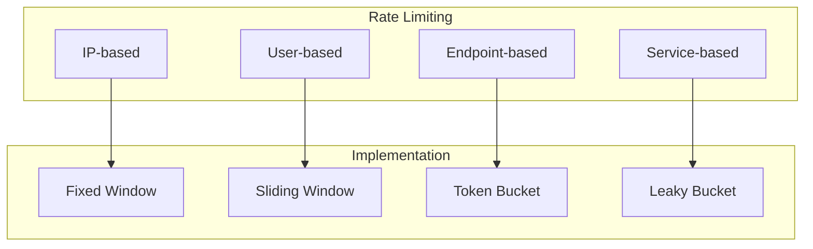

# Rate Limiting

## Purpose
_Describe the rate limiting policies and implementation in the Project Babel API._

## Scope
_This document covers API rate limiting rules, quotas, and throttling mechanisms._

## Dependencies
- [api-overview.md](api-overview.md)
- [authentication.md](authentication.md)
- [error-handling.md](error-handling.md)
- [caching.md](caching.md)
- [monitoring.md](../development/monitoring.md)

## See Also
- [api-overview.md](api-overview.md) - API architecture
- [authentication.md](authentication.md) - Authentication
- [error-handling.md](error-handling.md) - Error handling
- [caching.md](caching.md) - Caching strategies
- [monitoring.md](../development/monitoring.md) - Rate limit monitoring
- [API Overview](api-overview.md) - General API documentation

## Overview

This document describes how rate limiting is implemented to protect the API from abuse.

## Rate Limiting Strategy

### 1. Rate Limiting Types


### 2. Rate Limit Headers
```
X-RateLimit-Limit: 100
X-RateLimit-Remaining: 95
X-RateLimit-Reset: 1616789012
Retry-After: 60
```

## Rate Limits

### 1. Default Limits
```yaml
rate_limits:
  default:
    requests: 100
    period: 60  # seconds
  authenticated:
    requests: 1000
    period: 60
  admin:
    requests: 5000
    period: 60
```

### 2. Endpoint-Specific Limits
```yaml
endpoints:
  /api/v1/translations:
    get:
      limit: 100
      period: 60
    post:
      limit: 50
      period: 60
  /api/v1/auth/login:
    post:
      limit: 5
      period: 60
```

## Implementation

### 1. Rate Limiter Service
```php
class RateLimiter
{
    public function isAllowed(string $key, int $limit, int $period): bool
    {
        $current = $this->redis->incr($key);
        
        if ($current === 1) {
            $this->redis->expire($key, $period);
        }
        
        return $current <= $limit;
    }
}
```

### 2. Rate Limit Middleware
```php
class RateLimitMiddleware
{
    public function handle(Request $request, Closure $next): Response
    {
        $key = $this->getRateLimitKey($request);
        $limit = $this->getRateLimit($request);
        
        if (!$this->rateLimiter->isAllowed($key, $limit, 60)) {
            throw new RateLimitExceededException();
        }
        
        $response = $next($request);
        
        $this->addRateLimitHeaders($response);
        
        return $response;
    }
}
```

## Rate Limit Keys

### 1. Key Generation
```php
class RateLimitKeyGenerator
{
    public function generateKey(Request $request): string
    {
        $parts = [
            'rate_limit',
            $request->ip(),
            $request->user()?->getId() ?? 'anonymous',
            $request->path()
        ];
        
        return implode(':', $parts);
    }
}
```

### 2. Key Types
- IP-based keys
- User-based keys
- Endpoint-based keys
- Service-based keys

## Rate Limit Policies

### 1. Fixed Window
```php
class FixedWindowRateLimiter
{
    public function isAllowed(string $key, int $limit, int $period): bool
    {
        $current = $this->redis->incr($key);
        
        if ($current === 1) {
            $this->redis->expire($key, $period);
        }
        
        return $current <= $limit;
    }
}
```

### 2. Sliding Window
```php
class SlidingWindowRateLimiter
{
    public function isAllowed(string $key, int $limit, int $period): bool
    {
        $now = time();
        $window = $this->redis->zrangebyscore($key, $now - $period, $now);
        
        if (count($window) >= $limit) {
            return false;
        }
        
        $this->redis->zadd($key, $now, uniqid());
        $this->redis->expire($key, $period);
        
        return true;
    }
}
```

## Error Handling

### 1. Rate Limit Errors
```json
{
  "error": {
    "code": "RATE_LIMIT_EXCEEDED",
    "message": "Rate limit exceeded",
    "details": {
      "limit": 100,
      "remaining": 0,
      "reset": "2024-03-28T11:00:00Z"
    }
  }
}
```

### 2. Retry-After Header
```
HTTP/1.1 429 Too Many Requests
Retry-After: 60
X-RateLimit-Limit: 100
X-RateLimit-Remaining: 0
X-RateLimit-Reset: 1616789012
```

## Monitoring

### 1. Rate Limit Metrics
- Request counts
- Rate limit hits
- Rate limit bypasses
- Rate limit resets

### 2. Rate Limit Logging
```json
{
  "timestamp": "2024-03-28T10:00:00Z",
  "event": "RATE_LIMIT_HIT",
  "key": "rate_limit:192.168.1.1:user123:/api/v1/translations",
  "limit": 100,
  "current": 101,
  "ip": "192.168.1.1",
  "user_id": "user123"
}
```

## Best Practices

### 1. Rate Limit Guidelines
- Set appropriate limits
- Use different limits for different endpoints
- Consider user roles
- Implement graceful degradation
- Monitor and adjust limits

### 2. Client Guidelines
- Handle rate limit responses
- Implement exponential backoff
- Cache responses when possible
- Use bulk operations
- Monitor rate limit headers

## Rate Limit Exemptions

### 1. Internal Services

Internal services can request rate limit exemptions by:
1. Using a service account
2. Including a special API key
3. Making requests from whitelisted IPs

### 2. High-Priority Operations

Certain operations can be marked as high-priority:
1. Critical translations
2. Emergency updates
3. System maintenance

## Monitoring and Alerts

### 1. Rate Limit Monitoring

```php
class RateLimitMonitor
{
    public function monitorRateLimits(): void
    {
        $metrics = $this->collectMetrics();
        
        if ($metrics['remaining'] < $metrics['limit'] * 0.1) {
            $this->sendAlert('Rate limit warning', $metrics);
        }
    }
}
```

### 2. Usage Analytics

```php
class UsageAnalytics
{
    public function trackUsage(): array
    {
        return [
            'total_requests' => $this->getTotalRequests(),
            'rate_limit_hits' => $this->getRateLimitHits(),
            'average_response_time' => $this->getAverageResponseTime()
        ];
    }
}
```

## Support

For rate limiting issues:
- Check the [API Documentation](README.md)
- Review the [Error Handling](error-handling.md) documentation
- Contact support: api-support@projectbabel.org 