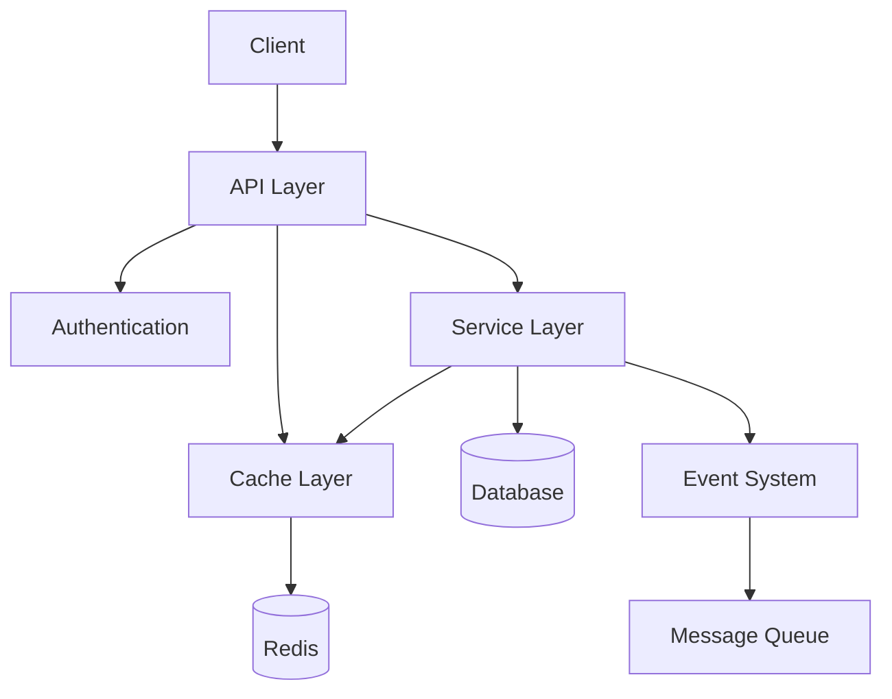

# Architecture Overview

## System Architecture



## Component Architecture

### API Layer
- RESTful endpoints
- Request validation
- Response formatting
- Rate limiting
- CORS handling

### Authentication
- JWT tokens
- OAuth2 support
- Role-based access
- API key management
- Session handling

### Service Layer
- Business logic
- Data validation
- Transaction management
- Event dispatching
- Cache management

### Database Layer
- Entity management
- Query optimization
- Migration handling
- Connection pooling
- Backup management

### Cache Layer
- Redis integration
- Cache strategies
- Invalidation rules
- Cache warming
- Statistics tracking

### Event System
- Event dispatching
- Event listeners
- Async processing
- Error handling
- Retry mechanisms

## Data Flow

### Request Flow
1. Client request
2. API validation
3. Authentication check
4. Cache check
5. Service processing
6. Database operations
7. Cache updates
8. Event dispatching
9. Response formatting

### Response Flow
1. Data retrieval
2. Cache check
3. Data formatting
4. Response headers
5. Client delivery

## Database Schema

### Core Entities
- Users
- Translations
- Games
- Mods
- Languages
- Projects

### Relationships
- One-to-Many
- Many-to-Many
- One-to-One
- Inheritance
- Composition

### Indexes
- Primary keys
- Foreign keys
- Search indexes
- Unique constraints
- Composite indexes

## Component Details

### API Controllers
```php
class TranslationController extends AbstractController
{
    public function __construct(
        private readonly TranslationService $service,
        private readonly CacheInterface $cache
    ) {}

    #[Route('/api/translations', methods: ['GET'])]
    public function list(): Response
    {
        return $this->json($this->service->getTranslations());
    }
}
```

### Services
```php
class TranslationService
{
    public function __construct(
        private readonly TranslationRepository $repository,
        private readonly CacheInterface $cache
    ) {}

    public function getTranslation(string $id): ?Translation
    {
        $cacheKey = "translation:{$id}";
        return $this->cache->get($cacheKey, fn() => $this->repository->find($id));
    }
}
```

### Repositories
```php
class TranslationRepository extends ServiceEntityRepository
{
    public function findByGame(string $gameId): array
    {
        return $this->createQueryBuilder('t')
            ->andWhere('t.game = :gameId')
            ->setParameter('gameId', $gameId)
            ->getQuery()
            ->getResult();
    }
}
```

## Directory Structure

```
src/
├── Controller/    # API endpoints
├── Entity/        # Database entities
├── Service/       # Business logic
├── Repository/    # Data access
├── Event/         # Event classes
├── Exception/     # Custom exceptions
└── ValueObject/   # Value objects
```

## Key Design Patterns

### Repository Pattern
- Data access abstraction
- Query encapsulation
- Cache integration
- Transaction management

### Service Pattern
- Business logic encapsulation
- Dependency injection
- Event dispatching
- Cache management

### Event Pattern
- Decoupled components
- Async processing
- Error handling
- Retry mechanisms

### Factory Pattern
- Object creation
- Configuration management
- Dependency resolution
- Testing support

## Security Architecture

### Authentication
- JWT tokens
- OAuth2 support
- API keys
- Session management

### Authorization
- Role-based access
- Permission system
- Resource ownership
- Access control

### Data Protection
- Input validation
- Output escaping
- SQL injection prevention
- XSS prevention

## Caching Strategy

### Cache Layers
- Application cache
- Distributed cache
- Database cache
- Browser cache

### Cache Invalidation
- Time-based
- Event-based
- Manual invalidation
- Pattern-based

### Cache Optimization
- Cache warming
- Cache statistics
- Cache monitoring
- Cache cleanup

## Deployment Architecture

### Infrastructure
- Docker containers
- Load balancing
- Database clusters
- Cache clusters

### Monitoring
- Application metrics
- Error tracking
- Performance monitoring
- Security monitoring

### Scaling
- Horizontal scaling
- Vertical scaling
- Database sharding
- Cache distribution 