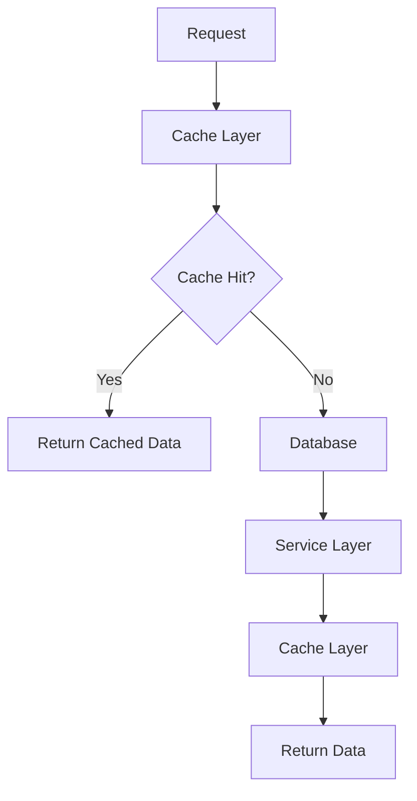

# Caching Strategy

## Overview
This document outlines the caching strategy for Project Babel, including cache layers, invalidation rules, and performance optimization techniques.

## Cache Architecture



## Cache Layers

### Application Cache
```php
class TranslationCache
{
    public function __construct(
        private readonly CacheInterface $cache,
        private readonly TranslationRepository $repository
    ) {}

    public function get(string $id): ?Translation
    {
        $cacheKey = "translation:{$id}";
        return $this->cache->get($cacheKey, fn() => $this->repository->find($id));
    }

    public function set(Translation $translation): void
    {
        $cacheKey = "translation:{$translation->getId()}";
        $this->cache->set($cacheKey, $translation, 3600);
    }
}
```

### Distributed Cache
```yaml
framework:
    cache:
        app: cache.adapter.redis
        default_redis_provider: '%env(REDIS_URL)%'
```

### Database Cache
```php
class TranslationRepository
{
    public function findWithCache(string $id): ?Translation
    {
        return $this->createQueryBuilder('t')
            ->andWhere('t.id = :id')
            ->setParameter('id', $id)
            ->getQuery()
            ->setResultCacheId("translation:{$id}")
            ->setResultCacheLifetime(3600)
            ->getOneOrNullResult();
    }
}
```

## Cache Implementation

### Redis Configuration
```yaml
framework:
    cache:
        pools:
            app:
                adapter: cache.adapter.redis
                provider: '%env(REDIS_URL)%'
                default_lifetime: 3600
                tags: true
```

### Cache Keys
```php
class CacheKeyGenerator
{
    public function generateTranslationKey(string $id): string
    {
        return "translation:{$id}";
    }

    public function generateUserKey(string $id): string
    {
        return "user:{$id}";
    }

    public function generateGameKey(string $id): string
    {
        return "game:{$id}";
    }
}
```

## Cache Invalidation

### Time-Based Invalidation
```php
class CacheManager
{
    public function __construct(
        private readonly CacheInterface $cache,
        private readonly TagAwareCacheInterface $taggedCache
    ) {}

    public function invalidateByTags(array $tags): void
    {
        $this->taggedCache->invalidateTags($tags);
    }

    public function invalidateByPattern(string $pattern): void
    {
        $keys = $this->cache->getKeys($pattern);
        foreach ($keys as $key) {
            $this->cache->delete($key);
        }
    }
}
```

### Event-Based Invalidation
```php
class TranslationListener
{
    public function onTranslationUpdated(TranslationUpdatedEvent $event): void
    {
        $translation = $event->getTranslation();
        $this->cache->delete("translation:{$translation->getId()}");
        $this->cache->delete("game:{$translation->getGame()->getId()}:translations");
    }
}
```

### Manual Invalidation
```php
class CacheInvalidator
{
    public function invalidateTranslation(string $id): void
    {
        $this->cache->delete("translation:{$id}");
    }

    public function invalidateGameTranslations(string $gameId): void
    {
        $this->cache->delete("game:{$gameId}:translations");
    }
}
```

## Cache Strategies

### Read-Through Cache
```php
class TranslationService
{
    public function getTranslation(string $id): ?Translation
    {
        $cacheKey = "translation:{$id}";
        return $this->cache->get($cacheKey, function () use ($id) {
            $translation = $this->repository->find($id);
            if ($translation) {
                $this->cache->set($cacheKey, $translation, 3600);
            }
            return $translation;
        });
    }
}
```

### Write-Through Cache
```php
class TranslationService
{
    public function updateTranslation(Translation $translation): void
    {
        $this->repository->save($translation);
        $this->cache->set(
            "translation:{$translation->getId()}",
            $translation,
            3600
        );
    }
}
```

### Cache-Aside
```php
class TranslationService
{
    public function getTranslationsByGame(string $gameId): array
    {
        $cacheKey = "game:{$gameId}:translations";
        $translations = $this->cache->get($cacheKey);
        
        if ($translations === null) {
            $translations = $this->repository->findByGame($gameId);
            $this->cache->set($cacheKey, $translations, 3600);
        }
        
        return $translations;
    }
}
```

## Performance Optimization

### Cache Warming
```php
class CacheWarmer
{
    public function warmTranslationCache(): void
    {
        $translations = $this->repository->findAll();
        foreach ($translations as $translation) {
            $this->cache->set(
                "translation:{$translation->getId()}",
                $translation,
                3600
            );
        }
    }
}
```

### Cache Statistics
```php
class CacheStatsCollector
{
    public function collectStats(): array
    {
        return [
            'hit_rate' => $this->cache->getHitRate(),
            'miss_rate' => $this->cache->getMissRate(),
            'memory_usage' => $this->cache->getMemoryUsage(),
            'item_count' => $this->cache->getItemCount()
        ];
    }
}
```

## Monitoring and Maintenance

### Cache Monitoring
```php
class CacheMonitor
{
    public function checkCacheHealth(): array
    {
        return [
            'status' => $this->checkConnection(),
            'memory_usage' => $this->getMemoryUsage(),
            'hit_rate' => $this->getHitRate(),
            'item_count' => $this->getItemCount()
        ];
    }
}
```

### Cache Maintenance
```php
class CacheMaintenance
{
    public function cleanup(): void
    {
        $this->cache->clear();
        $this->cache->reset();
    }

    public function optimize(): void
    {
        $this->cache->optimize();
    }
}
```

## Best Practices

### Cache Key Design
```php
class CacheKeyGenerator
{
    public function generateKey(string $type, string $id, ?string $context = null): string
    {
        $key = "{$type}:{$id}";
        if ($context) {
            $key .= ":{$context}";
        }
        return $key;
    }
}
```

### Cache Duration
```php
class CacheDuration
{
    public const SHORT = 300;    // 5 minutes
    public const MEDIUM = 3600;  // 1 hour
    public const LONG = 86400;   // 24 hours
}
```

### Cache Size Management
```php
class CacheSizeManager
{
    public function checkSize(): bool
    {
        $size = $this->cache->getSize();
        return $size < $this->maxSize;
    }

    public function cleanupIfNeeded(): void
    {
        if (!$this->checkSize()) {
            $this->cleanup();
        }
    }
}
```

## Future Considerations

### Cache Distribution
- Multi-region caching
- Cache synchronization
- Cache replication
- Cache failover

### Advanced Features
- Cache preloading
- Cache warming strategies
- Cache analytics
- Cache optimization

### Monitoring Improvements
- Real-time monitoring
- Alert system
- Performance metrics
- Usage analytics 