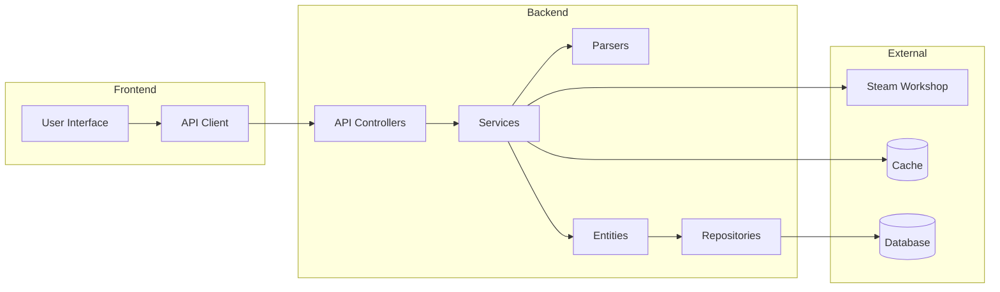
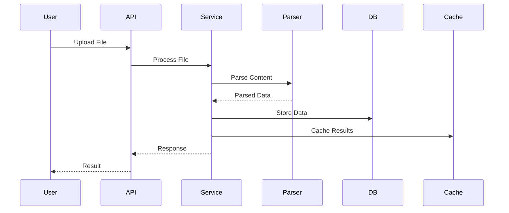

# Component Architecture

## Overview
This document details the internal architecture of each major component in Project Babel, including their responsibilities, interactions, and implementation details.

## Component Structure



## Component Details

### 1. Frontend Components

#### User Interface
- React-based SPA
- Component-based architecture
- State management with Redux
- Real-time updates via Mercure

#### API Client
- Axios for HTTP requests
- Request/response interceptors
- Error handling
- Authentication management

### 2. Backend Components

#### API Controllers
- RESTful endpoints
- Request validation
- Response formatting
- Error handling
- Rate limiting

#### Services
- Business logic implementation
- Transaction management
- Event dispatching
- Cache management

#### Parsers
- File format detection
- Content extraction
- Validation
- Error handling

#### Entities
- Data models
- Relationships
- Validation rules
- Lifecycle hooks

#### Repositories
- Data access layer
- Query optimization
- Caching strategies
- Transaction management

### 3. External Components

#### Steam Workshop Integration
- API client
- Data synchronization
- Error handling
- Rate limiting

#### Cache System
- Redis implementation
- Cache strategies
- Invalidation rules
- Performance optimization

#### Database
- PostgreSQL
- Schema management
- Indexing
- Query optimization

## Component Interactions

### Data Flow


## Design Patterns

### 1. Factory Pattern
- Used in parser creation
- Allows dynamic parser selection based on file type

### 2. Strategy Pattern
- Implemented in parsers
- Enables different parsing strategies for different file formats

### 3. Repository Pattern
- Used for data access abstraction
- Provides consistent interface for database operations

### 4. Service Layer Pattern
- Separates business logic from controllers
- Provides reusable business operations

### 5. Observer Pattern
- Used for real-time updates
- Implements event-driven architecture

## Directory Structure
For detailed information about the code organization, see the [Code Structure](../development/CODE_STRUCTURE.md) documentation.

## Core Components

### Translation Component

#### Responsibilities
- Translation management
- File parsing
- Content validation
- Version control
- Cache management

#### Implementation
```php
class TranslationService
{
    public function __construct(
        private readonly TranslationRepository $repository,
        private readonly CacheInterface $cache,
        private readonly EventDispatcherInterface $dispatcher
    ) {}

    public function getTranslation(string $id): ?Translation
    {
        $cacheKey = "translation:{$id}";
        return $this->cache->get($cacheKey, fn() => $this->repository->find($id));
    }

    public function createTranslation(array $data): Translation
    {
        $translation = new Translation($data);
        $this->repository->save($translation);
        $this->cache->delete("translation:{$translation->getId()}");
        $this->dispatcher->dispatch(new TranslationCreatedEvent($translation));
        return $translation;
    }
}
```

### Game Component

#### Responsibilities
- Game management
- Mod association
- Version tracking
- Metadata management
- Cache management

#### Implementation
```php
class GameService
{
    public function __construct(
        private readonly GameRepository $repository,
        private readonly CacheInterface $cache
    ) {}

    public function getGame(string $id): ?Game
    {
        $cacheKey = "game:{$id}";
        return $this->cache->get($cacheKey, fn() => $this->repository->find($id));
    }

    public function createGame(array $data): Game
    {
        $game = new Game($data);
        $this->repository->save($game);
        $this->cache->delete("game:{$game->getId()}");
        return $game;
    }
}
```

### Mod Component

#### Responsibilities
- Mod management
- Game association
- File management
- Version control
- Cache management

#### Implementation
```php
class ModService
{
    public function __construct(
        private readonly ModRepository $repository,
        private readonly CacheInterface $cache,
        private readonly FileManager $fileManager
    ) {}

    public function getMod(string $id): ?Mod
    {
        $cacheKey = "mod:{$id}";
        return $this->cache->get($cacheKey, fn() => $this->repository->find($id));
    }

    public function createMod(array $data): Mod
    {
        $mod = new Mod($data);
        $this->repository->save($mod);
        $this->cache->delete("mod:{$mod->getId()}");
        return $mod;
    }
}
```

### User Component

#### Responsibilities
- User management
- Authentication
- Authorization
- Profile management
- Activity tracking

#### Implementation
```php
class UserService
{
    public function __construct(
        private readonly UserRepository $repository,
        private readonly PasswordHasherInterface $hasher,
        private readonly TokenManagerInterface $tokenManager
    ) {}

    public function createUser(array $data): User
    {
        $user = new User($data);
        $user->setPassword($this->hasher->hashPassword($user, $data['password']));
        $this->repository->save($user);
        return $user;
    }

    public function authenticateUser(string $email, string $password): ?User
    {
        $user = $this->repository->findByEmail($email);
        if (!$user || !$this->hasher->isPasswordValid($user, $password)) {
            return null;
        }
        return $user;
    }
}
```

## Component Interactions

### Event System
```php
class TranslationCreatedEvent
{
    public function __construct(
        private readonly Translation $translation
    ) {}

    public function getTranslation(): Translation
    {
        return $this->translation;
    }
}

class TranslationListener
{
    public function onTranslationCreated(TranslationCreatedEvent $event): void
    {
        // Handle translation creation
        // Update cache
        // Send notifications
        // Update statistics
    }
}
```

### Cache System
```php
class CacheManager
{
    public function __construct(
        private readonly CacheInterface $cache,
        private readonly TagAwareCacheInterface $taggedCache
    ) {}

    public function get(string $key, callable $callback)
    {
        return $this->cache->get($key, $callback);
    }

    public function invalidateByTags(array $tags): void
    {
        $this->taggedCache->invalidateTags($tags);
    }
}
```

### Repository Pattern
```php
class TranslationRepository extends ServiceEntityRepository
{
    public function findByGame(string $gameId): array
    {
        return $this->createQueryBuilder('t')
            ->andWhere('t.game = :gameId')
            ->setParameter('gameId', $gameId)
            ->getQuery()
            ->getResult();
    }

    public function findByMod(string $modId): array
    {
        return $this->createQueryBuilder('t')
            ->andWhere('t.mod = :modId')
            ->setParameter('modId', $modId)
            ->getQuery()
            ->getResult();
    }
}
```

## Component Dependencies

### Service Container
```yaml
services:
    App\Service\TranslationService:
        arguments:
            $repository: '@App\Repository\TranslationRepository'
            $cache: '@cache.app'
            $dispatcher: '@event_dispatcher'

    App\Service\GameService:
        arguments:
            $repository: '@App\Repository\GameRepository'
            $cache: '@cache.app'

    App\Service\ModService:
        arguments:
            $repository: '@App\Repository\ModRepository'
            $cache: '@cache.app'
            $fileManager: '@App\Service\FileManager'
```

## Component Testing

### Unit Tests
```php
class TranslationServiceTest extends TestCase
{
    private TranslationRepository $repository;
    private CacheInterface $cache;
    private TranslationService $service;

    protected function setUp(): void
    {
        $this->repository = $this->createMock(TranslationRepository::class);
        $this->cache = $this->createMock(CacheInterface::class);
        $this->service = new TranslationService($this->repository, $this->cache);
    }

    public function testGetTranslation(): void
    {
        $translation = new Translation();
        $this->repository->expects($this->once())
            ->method('find')
            ->with('123')
            ->willReturn($translation);

        $result = $this->service->getTranslation('123');
        $this->assertSame($translation, $result);
    }
}
```

## Component Monitoring

### Metrics Collection
```php
class MetricsCollector
{
    public function collectTranslationMetrics(): array
    {
        return [
            'total_translations' => $this->repository->count([]),
            'translations_by_game' => $this->repository->countByGame(),
            'translations_by_mod' => $this->repository->countByMod(),
            'cache_hit_rate' => $this->cache->getHitRate()
        ];
    }
}
```

### Health Checks
```php
class HealthChecker
{
    public function checkTranslationComponent(): array
    {
        return [
            'status' => 'ok',
            'database' => $this->checkDatabase(),
            'cache' => $this->checkCache(),
            'file_system' => $this->checkFileSystem()
        ];
    }
}
```

## Component Security

### Input Validation
```php
class TranslationValidator
{
    public function validate(array $data): array
    {
        $errors = [];
        if (empty($data['key'])) {
            $errors['key'] = 'Translation key is required';
        }
        if (empty($data['value'])) {
            $errors['value'] = 'Translation value is required';
        }
        return $errors;
    }
}
```

### Access Control
```php
class TranslationVoter
{
    public function canEdit(User $user, Translation $translation): bool
    {
        return $user->hasRole('ROLE_ADMIN') ||
               $translation->getCreatedBy() === $user;
    }
}
```

## Future Improvements

### Component Extensions
- Plugin system
- Custom validators
- Custom repositories
- Custom services

### Performance Optimizations
- Lazy loading
- Batch operations
- Cache optimization
- Query optimization

### Security Enhancements
- Input sanitization
- Output escaping
- Rate limiting
- Access control
