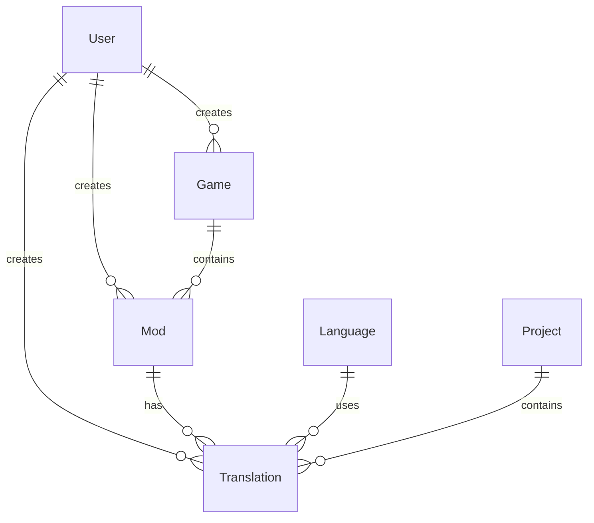

# Database Schema

## Entity Relationships



## Core Entities

### User
```php
class User
{
    private string $id;
    private string $email;
    private string $password;
    private array $roles;
    private \DateTimeImmutable $createdAt;
    private \DateTimeImmutable $updatedAt;
    private Collection $translations;
    private Collection $games;
    private Collection $mods;
}
```

### Translation
```php
class Translation
{
    private string $id;
    private string $key;
    private string $value;
    private string $locale;
    private User $createdBy;
    private Game $game;
    private Mod $mod;
    private Project $project;
    private \DateTimeImmutable $createdAt;
    private \DateTimeImmutable $updatedAt;
}
```

### Game
```php
class Game
{
    private string $id;
    private string $name;
    private string $description;
    private User $createdBy;
    private Collection $mods;
    private \DateTimeImmutable $createdAt;
    private \DateTimeImmutable $updatedAt;
}
```

### Mod
```php
class Mod
{
    private string $id;
    private string $name;
    private string $description;
    private User $createdBy;
    private Game $game;
    private Collection $translations;
    private \DateTimeImmutable $createdAt;
    private \DateTimeImmutable $updatedAt;
}
```

### Language
```php
class Language
{
    private string $id;
    private string $code;
    private string $name;
    private Collection $translations;
    private \DateTimeImmutable $createdAt;
    private \DateTimeImmutable $updatedAt;
}
```

### Project
```php
class Project
{
    private string $id;
    private string $name;
    private string $description;
    private User $createdBy;
    private Collection $translations;
    private \DateTimeImmutable $createdAt;
    private \DateTimeImmutable $updatedAt;
}
```

## Indexes

### Primary Keys
- `user.id`
- `translation.id`
- `game.id`
- `mod.id`
- `language.id`
- `project.id`

### Foreign Keys
- `translation.created_by_id`
- `translation.game_id`
- `translation.mod_id`
- `translation.project_id`
- `game.created_by_id`
- `mod.created_by_id`
- `mod.game_id`

### Search Indexes
- `translation.key`
- `translation.value`
- `game.name`
- `mod.name`
- `project.name`

### Unique Constraints
- `user.email`
- `language.code`
- `translation.key_locale_game_mod_unique`

## Design Decisions

### Entity Design
- UUID primary keys
- Timestamps for all entities
- Soft delete support
- Audit trail support
- Version control support

### Relationship Design
- Bidirectional relationships
- Cascade operations
- Lazy loading
- Eager loading support
- Collection interfaces

### Performance Considerations
- Indexed fields
- Optimized queries
- Caching strategy
- Batch operations
- Connection pooling

## Data Integrity

### Constraints
- Foreign key constraints
- Unique constraints
- Check constraints
- Default values
- Not null constraints

### Validation
- Entity validation
- Value validation
- Relationship validation
- Business rule validation
- Custom validators

### Triggers
- Audit logging
- Version control
- Cache invalidation
- Event dispatching
- Data synchronization

## Performance Optimization

### Query Optimization
- Indexed fields
- Query caching
- Result caching
- Query hints
- Query logging

### Connection Management
- Connection pooling
- Connection limits
- Timeout settings
- Retry logic
- Failover support

### Cache Strategy
- Entity cache
- Query cache
- Result cache
- Cache tags
- Cache invalidation

## Migration Strategy

### Version Control
- Migration versions
- Rollback support
- Data migration
- Schema updates
- Index management

### Deployment
- Zero downtime
- Backup strategy
- Rollback plan
- Verification steps
- Monitoring

### Testing
- Migration tests
- Data integrity tests
- Performance tests
- Rollback tests
- Integration tests

## Monitoring

### Performance Metrics
- Query times
- Cache hit rates
- Connection usage
- Index usage
- Lock contention

### Health Checks
- Connection status
- Table sizes
- Index usage
- Lock status
- Cache status

### Alerts
- Performance alerts
- Error alerts
- Capacity alerts
- Security alerts
- Health alerts

## Backup Strategy

### Backup Types
- Full backup
- Incremental backup
- Transaction log backup
- Point-in-time recovery
- Disaster recovery

### Backup Schedule
- Daily full backup
- Hourly incremental
- Continuous log backup
- Weekly verification
- Monthly archive

### Recovery
- Recovery testing
- Recovery procedures
- Data validation
- Performance impact
- Business continuity

## Security

### Access Control
- Row-level security
- Column-level security
- Role-based access
- User permissions
- Audit logging

### Data Protection
- Encryption at rest
- Encryption in transit
- Key management
- Access logging
- Security monitoring

### Compliance
- Data retention
- Privacy compliance
- Audit requirements
- Security standards
- Regulatory compliance 