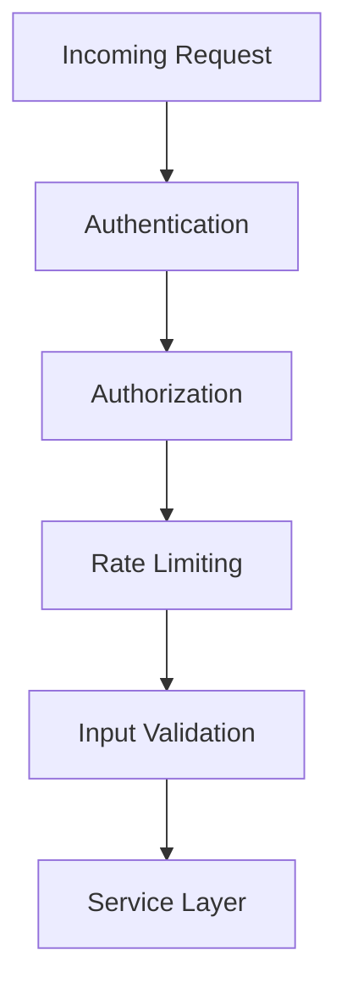

# Security Architecture

## Overview
This document outlines the security architecture of Project Babel, including authentication, authorization, data protection, and security best practices.

## Security Components



## Authentication

### JWT Authentication
```php
class JWTManager
{
    public function __construct(
        private readonly string $secret,
        private readonly int $expiration
    ) {}

    public function createToken(User $user): string
    {
        $payload = [
            'sub' => $user->getId(),
            'email' => $user->getEmail(),
            'roles' => $user->getRoles(),
            'exp' => time() + $this->expiration
        ];

        return JWT::encode($payload, $this->secret, 'HS256');
    }

    public function validateToken(string $token): ?array
    {
        try {
            return JWT::decode($token, $this->secret, ['HS256']);
        } catch (\Exception $e) {
            return null;
        }
    }
}
```

### OAuth2 Integration
```yaml
security:
    firewalls:
        oauth2:
            pattern: ^/api
            oauth2: true
            provider: app_user_provider
            custom_authenticator: App\Security\OAuth2Authenticator
```

### Password Security
- Bcrypt password hashing
- Password complexity requirements
- Password reset flow
- Session management

## Authorization

### Role-Based Access Control
```php
class SecurityVoter
{
    public function vote(TokenInterface $token, $subject, array $attributes): int
    {
        $user = $token->getUser();
        
        if (!$user instanceof User) {
            return self::ACCESS_DENIED;
        }

        foreach ($attributes as $attribute) {
            if (!$this->supports($attribute, $subject)) {
                continue;
            }

            if ($this->hasRole($user, $attribute)) {
                return self::ACCESS_GRANTED;
            }
        }

        return self::ACCESS_DENIED;
    }
}
```

### Resource-Based Permissions
```php
class TranslationVoter
{
    public function canEdit(User $user, Translation $translation): bool
    {
        return $user->hasRole('ROLE_ADMIN') ||
               $translation->getCreatedBy() === $user;
    }

    public function canDelete(User $user, Translation $translation): bool
    {
        return $user->hasRole('ROLE_ADMIN');
    }
}
```

## Rate Limiting

### API Rate Limiting
```php
class RateLimiter
{
    public function __construct(
        private readonly Redis $redis,
        private readonly int $limit,
        private readonly int $period
    ) {}

    public function isAllowed(string $ip): bool
    {
        $key = "rate_limit:{$ip}";
        $current = $this->redis->incr($key);
        
        if ($current === 1) {
            $this->redis->expire($key, $this->period);
        }
        
        return $current <= $this->limit;
    }
}
```

### Configuration
```yaml
rate_limiter:
    api:
        policy: 'fixed_window'
        limit: 100
        interval: '1 minute'
    auth:
        policy: 'token_bucket'
        limit: 5
        interval: '1 minute'
```

## Input Validation

### Request Validation
- Input sanitization
- Data type validation
- Format validation
- Size limits

### File Upload Security
- File type validation
- Size restrictions
- Malware scanning
- Secure storage

### Output Sanitization
```php
class TranslationSanitizer
{
    public function sanitize(string $value): string
    {
        return htmlspecialchars($value, ENT_QUOTES, 'UTF-8');
    }
}
```

## Security Headers

### HTTP Security Headers
```yaml
nelmio_security:
    content_security_policy:
        report_only: false
        directives:
            default-src: ["'self'"]
            script-src: ["'self'", "'unsafe-inline'"]
            style-src: ["'self'", "'unsafe-inline'"]
            img-src: ["'self'", "data:", "https:"]
            connect-src: ["'self'"]
            font-src: ["'self'"]
            object-src: ["'none'"]
            media-src: ["'self'"]
            frame-src: ["'none'"]
            sandbox: ["allow-forms", "allow-scripts", "allow-same-origin"]
```

## Data Protection

### Encryption
- Data at rest encryption
- Data in transit encryption
- Key management
- Encryption algorithms

### Sensitive Data
- PII protection
- Data masking
- Audit logging
- Data retention

## Security Monitoring

### Logging
```php
class SecurityLogger
{
    public function logAuthenticationFailure(string $ip, string $username): void
    {
        $this->logger->warning('Authentication failure', [
            'ip' => $ip,
            'username' => $username,
            'timestamp' => new \DateTime()
        ]);
    }

    public function logAccessDenied(User $user, string $resource): void
    {
        $this->logger->warning('Access denied', [
            'user' => $user->getId(),
            'resource' => $resource,
            'timestamp' => new \DateTime()
        ]);
    }
}
```

### Security Events
```php
class SecurityEventSubscriber implements EventSubscriberInterface
{
    public static function getSubscribedEvents(): array
    {
        return [
            SecurityEvents::INTERACTIVE_LOGIN_SUCCESS => 'onLoginSuccess',
            SecurityEvents::INTERACTIVE_LOGIN_FAILURE => 'onLoginFailure',
            SecurityEvents::ACCESS_DENIED => 'onAccessDenied'
        ];
    }

    public function onLoginSuccess(InteractiveLoginEvent $event): void
    {
        // Log successful login
        // Update last login timestamp
        // Check for suspicious activity
    }
}
```

## Security Testing

### Security Tests
```php
class SecurityTest extends WebTestCase
{
    public function testAuthenticationRequired(): void
    {
        $client = static::createClient();
        $client->request('GET', '/api/translations');
        
        $this->assertResponseStatusCodeSame(401);
    }

    public function testAuthorization(): void
    {
        $client = static::createClient();
        $user = $this->createUser(['ROLE_USER']);
        $client->loginUser($user);
        
        $client->request('GET', '/api/admin/users');
        
        $this->assertResponseStatusCodeSame(403);
    }
}
```

## Incident Response

### Security Incident Handling
```php
class SecurityIncidentHandler
{
    public function handleIncident(SecurityIncident $incident): void
    {
        // Log incident details
        $this->logger->error('Security incident detected', [
            'type' => $incident->getType(),
            'severity' => $incident->getSeverity(),
            'details' => $incident->getDetails()
        ]);

        // Notify security team
        $this->notifySecurityTeam($incident);

        // Take immediate action if necessary
        if ($incident->getSeverity() === 'high') {
            $this->takeEmergencyAction($incident);
        }
    }
}
```

## Compliance

### GDPR Compliance
```php
class DataProtectionManager
{
    public function handleDataRequest(User $user, string $requestType): void
    {
        switch ($requestType) {
            case 'export':
                $this->exportUserData($user);
                break;
            case 'delete':
                $this->deleteUserData($user);
                break;
            case 'rectify':
                $this->rectifyUserData($user);
                break;
        }
    }
}
```

## Security Best Practices

### Code Security
- Input validation
- Output encoding
- SQL injection prevention
- XSS prevention

### Infrastructure Security
- Network security
- Firewall rules
- SSL/TLS configuration
- Regular updates

### Development Security
- Secure coding practices
- Code review process
- Security testing
- Dependency scanning

### Password Policies
```php
class PasswordPolicy
{
    public function validatePassword(string $password): array
    {
        $errors = [];
        
        if (strlen($password) < 8) {
            $errors[] = 'Password must be at least 8 characters long';
        }
        
        if (!preg_match('/[A-Z]/', $password)) {
            $errors[] = 'Password must contain at least one uppercase letter';
        }
        
        if (!preg_match('/[a-z]/', $password)) {
            $errors[] = 'Password must contain at least one lowercase letter';
        }
        
        if (!preg_match('/[0-9]/', $password)) {
            $errors[] = 'Password must contain at least one number';
        }
        
        return $errors;
    }
}
```

### Session Management
```php
class SessionManager
{
    public function configureSession(): void
    {
        ini_set('session.cookie_httponly', 1);
        ini_set('session.cookie_secure', 1);
        ini_set('session.cookie_samesite', 'Strict');
        ini_set('session.gc_maxlifetime', 3600);
    }
}
```

## Future Security Enhancements

### Planned Improvements
- Two-factor authentication
- API key management
- Advanced rate limiting
- Security scanning integration
- Automated security testing
- Enhanced monitoring
- Incident response automation

## Future Considerations

### Security Roadmap
- Advanced authentication
- Enhanced monitoring
- AI-based security
- Blockchain integration

### Emerging Threats
- Threat intelligence
- Security updates
- Risk assessment
- Security training 