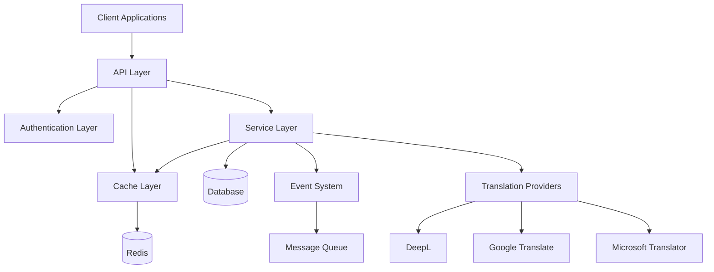
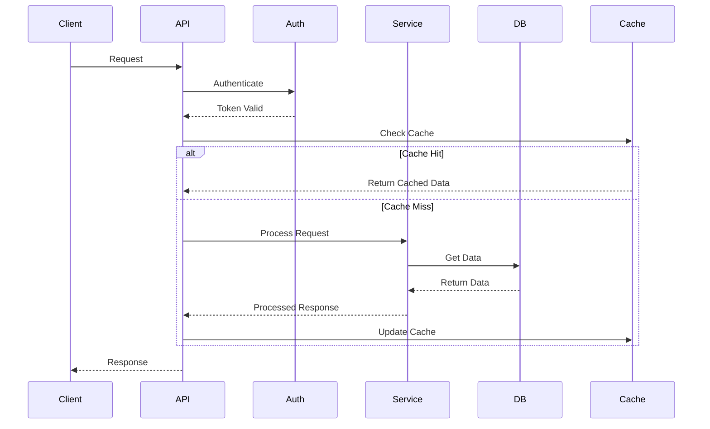
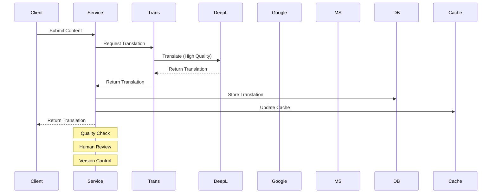
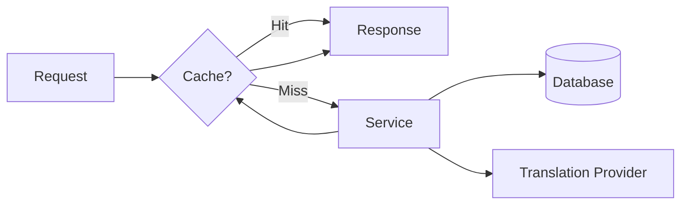

# System Architecture

## Overview

Project Babel is built on a modern, scalable architecture that separates concerns and promotes maintainability. This document outlines the high-level system architecture and component interactions.

## System Components

### 1. Client Applications
- Web Interface
- API Clients
- Game Mods
- Translation Tools

### 2. API Layer
- RESTful API
- GraphQL API
- WebSocket Server
- Rate Limiting
- Request Validation

### 3. Authentication Layer
- JWT Authentication
- OAuth2 Integration
- Role-Based Access Control
- API Key Management

### 4. Service Layer
- Translation Service
  - Manual Translation Management
  - Automatic Translation Integration
  - Translation Memory
  - Quality Control
- Game Service
- Mod Service
- User Service
- File Service

### 5. Database Layer
- PostgreSQL Database
- Doctrine ORM
- Database Migrations
- Query Optimization

### 6. Cache Layer
- Redis Cache
- File Cache
- Memory Cache
- Cache Invalidation

### 7. Event System
- Event Dispatcher
- Event Listeners
- Event Subscribers
- Async Event Processing

### 8. Message Queue
- RabbitMQ
- Job Processing
- Background Tasks
- Notification System

### 9. Translation Providers
- DeepL Integration
- Google Translate Integration
- Microsoft Translator Integration
- Custom Provider Support

## Data Flow

### Request Flow

### Translation Flow

## Security Architecture

### Authentication
- JWT Tokens
- OAuth2 Flows
- API Keys
- Session Management

### Authorization
- Role-Based Access
- Resource Permissions
- API Scopes
- Rate Limits

### Data Protection
- Encryption at Rest
- Encryption in Transit
- Data Sanitization
- Input Validation

## Performance Architecture

### Caching Strategy

### Database Optimization
- Query Optimization
- Index Management
- Connection Pooling
- Read Replicas

### Load Balancing
- Request Distribution
- Health Checks
- Auto Scaling
- Failover

## Monitoring Architecture

### Metrics Collection
- Application Metrics
- System Metrics
- Business Metrics
- Custom Metrics

### Logging
- Application Logs
- Access Logs
- Error Logs
- Audit Logs

### Alerting
- Performance Alerts
- Error Alerts
- Security Alerts
- Business Alerts

## Deployment Architecture

### Infrastructure
- Docker Containers
- Kubernetes Clusters
- Load Balancers
- CDN Integration

### CI/CD Pipeline
- Automated Testing
- Automated Deployment
- Environment Management
- Version Control

### Backup Strategy
- Database Backups
- File Backups
- Configuration Backups
- Disaster Recovery

## Integration Points

### External Services
- Translation Providers
- Game Platforms
- Mod Platforms
- Authentication Providers

### APIs
- REST API
- GraphQL API
- WebSocket API
- Webhook Support

### File Systems
- Local Storage
- Cloud Storage
- CDN Storage
- Backup Storage

## Development Architecture

### Code Organization
- Modular Structure
- Service Layer
- Repository Layer
- Entity Layer

### Testing Strategy
- Unit Tests
- Integration Tests
- API Tests
- Performance Tests

### Development Tools
- IDE Integration
- Debug Tools
- Profiling Tools
- Code Quality Tools

## Future Considerations

### Scalability
- Horizontal Scaling
- Vertical Scaling
- Database Sharding
- Cache Distribution

### Performance
- Query Optimization
- Cache Optimization
- Asset Optimization
- Network Optimization

### Security
- Security Updates
- Compliance Updates
- Monitoring Updates
- Access Control Updates

### Features
- New Translation Providers
- Advanced Analytics
- Machine Learning
- AI Integration 