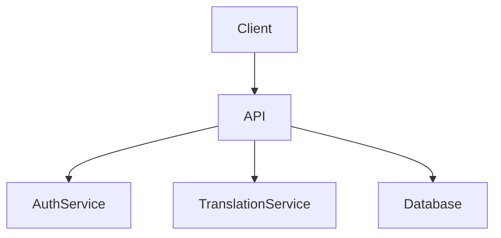
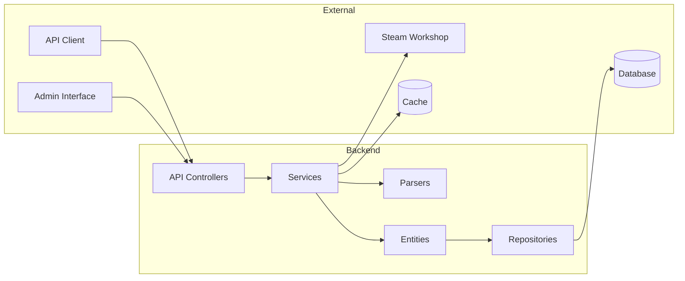
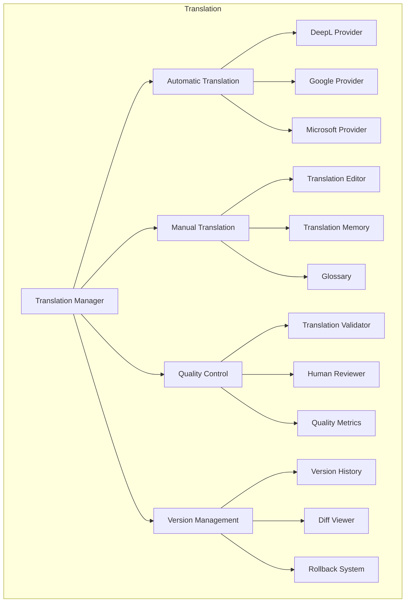
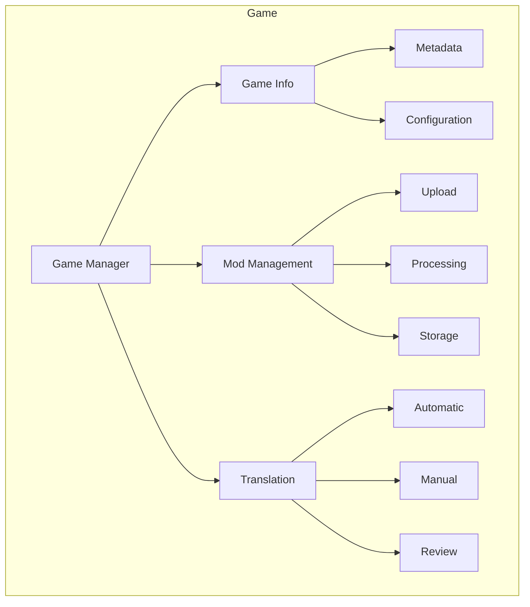

# Component Architecture

## Purpose
_Describe the component-level architecture and interactions within Project Babel._

## Scope
_This document covers component relationships, dependencies, and internal communication patterns._

## Dependencies
- [system-architecture.md](system-architecture.md)
- [database-schema.md](database-schema.md)
- [security-architecture.md](security-architecture.md)
- [code-structure.md](../development/code-structure.md)
- [clients.md](clients.md)

## See Also
- [system-architecture.md](system-architecture.md) - System architecture
- [database-schema.md](database-schema.md) - Database schema
- [security-architecture.md](security-architecture.md) - Security architecture
- [API Clients](clients.md) - Client architecture and integration

## Overview

This document describes the component-level architecture of Project Babel, detailing how different components interact with each other and their responsibilities within the system.

## Component Relationships

## Component Structure

## Component Details

### 1. External Components

#### API Client
- RESTful API consumption
- Authentication handling
- Rate limiting
- Error handling

#### Admin Interface
- Technical management interface
- System monitoring
- Configuration management
- Debug tools

### 2. Backend Components

#### API Controllers
- RESTful endpoints
- Request validation
- Response formatting
- Error handling
- Rate limiting

#### Services
- Business logic implementation
- Transaction management
- Event dispatching
- Cache management

#### Parsers
- File format detection
- Content extraction
- Validation
- Error handling

#### Entities
- Data models
- Relationships
- Validation rules
- Lifecycle hooks

#### Repositories
- Data access layer
- Query optimization
- Caching strategies
- Transaction management

### 3. External Components

#### Steam Workshop Integration
- API client
- Data synchronization
- Error handling
- Rate limiting

#### Cache System
- Redis implementation
- Cache strategies
- Invalidation rules
- Performance optimization

#### Database
- PostgreSQL
- Schema management
- Indexing
- Query optimization

## Component Interactions

### Data Flow

## Design Patterns

### 1. Factory Pattern
- Used in parser creation
- Allows dynamic parser selection based on file type

### 2. Strategy Pattern
- Implemented in parsers
- Enables different parsing strategies for different file formats

### 3. Repository Pattern
- Used for data access abstraction
- Provides consistent interface for database operations

### 4. Service Layer Pattern
- Separates business logic from controllers
- Provides reusable business operations

### 5. Observer Pattern
- Used for real-time updates
- Implements event-driven architecture

## Directory Structure
For detailed information about the code organization, see the [Code Structure](../development/code-structure.md) documentation.

## Core Components

### Translation Component

#### Translation Manager
- Orchestrates translation workflow
- Manages translation providers
- Handles quality control
- Controls versioning

#### Automatic Translation
- Provider selection
- Translation caching
- Error handling
- Rate limiting

#### Manual Translation
- Editor interface
- Memory integration
- Glossary access
- Context viewing

#### Quality Control
- Automated checks
- Human review
- Quality metrics
- Issue tracking

#### Version Management
- History tracking
- Diff generation
- Rollback support
- Branch management

### Game Component

#### Game Manager
- Game information management
- Mod handling
- Translation coordination
- Version control

#### Game Info
- Metadata management
- Configuration handling
- Version tracking
- Dependency management

#### Mod Management
- Upload handling
- Processing pipeline
- Storage management
- Version control

#### Translation
- Automatic translation
- Manual translation
- Review process
- Quality control

## Error Handling

### 1. API Errors
- Standardized error responses
- Error codes and messages
- Validation errors
- Rate limit errors

### 2. Service Errors
- Exception handling
- Error logging
- Recovery procedures
- Alerting system

### 3. External Errors
- Integration failures
- Timeout handling
- Retry mechanisms
- Fallback options

## Performance Considerations

### 1. Caching
- Response caching
- Query caching
- File caching
- Cache invalidation

### 2. Optimization
- Query optimization
- Resource pooling
- Connection management
- Load balancing

### 3. Monitoring
- Performance metrics
- Resource usage
- Response times
- Error rates

## Security Measures

### 1. Authentication
- JWT implementation
- API key management
- Session handling
- Token validation

### 2. Authorization
- Role-based access
- Permission management
- Resource protection
- Audit logging

### 3. Data Protection
- Input validation
- Output sanitization
- Encryption
- Secure storage