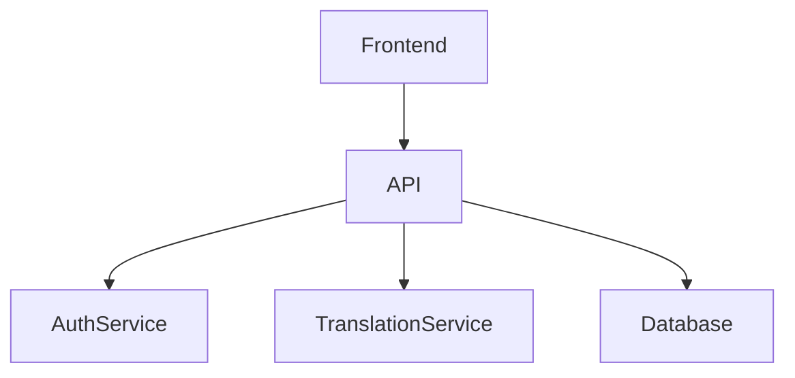
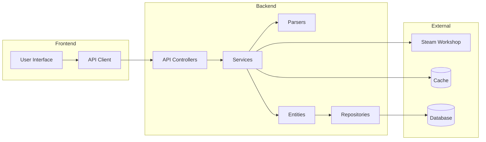
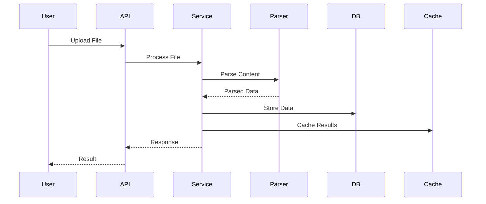
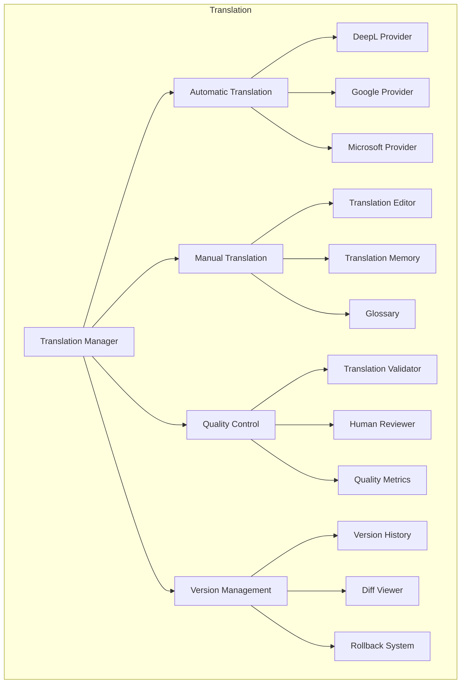
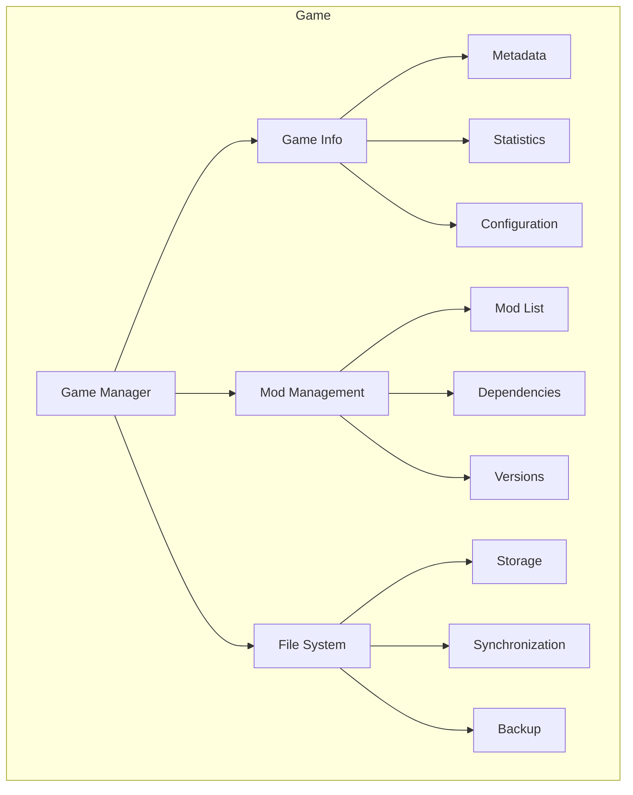
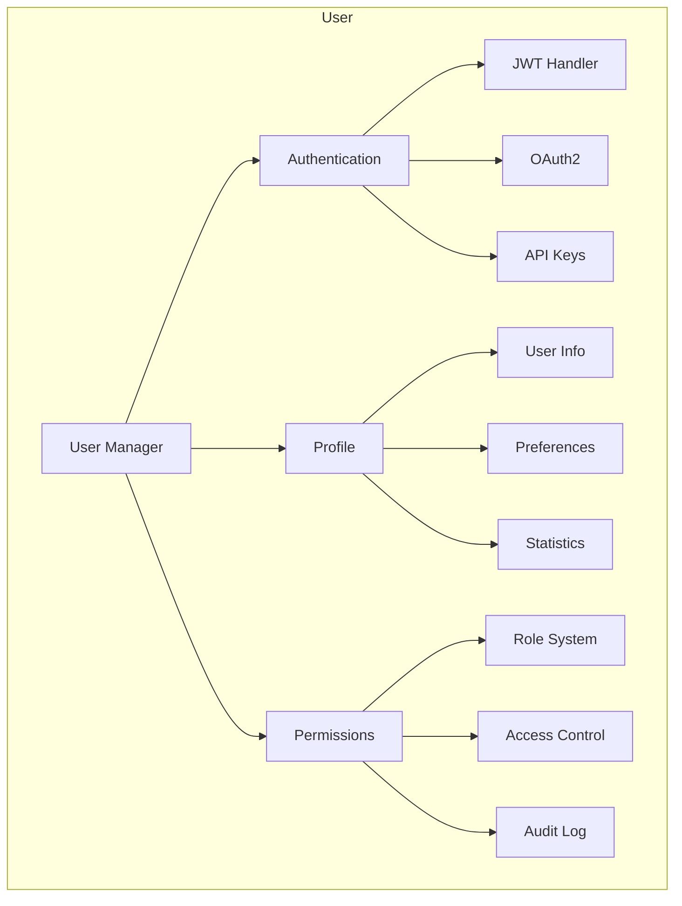
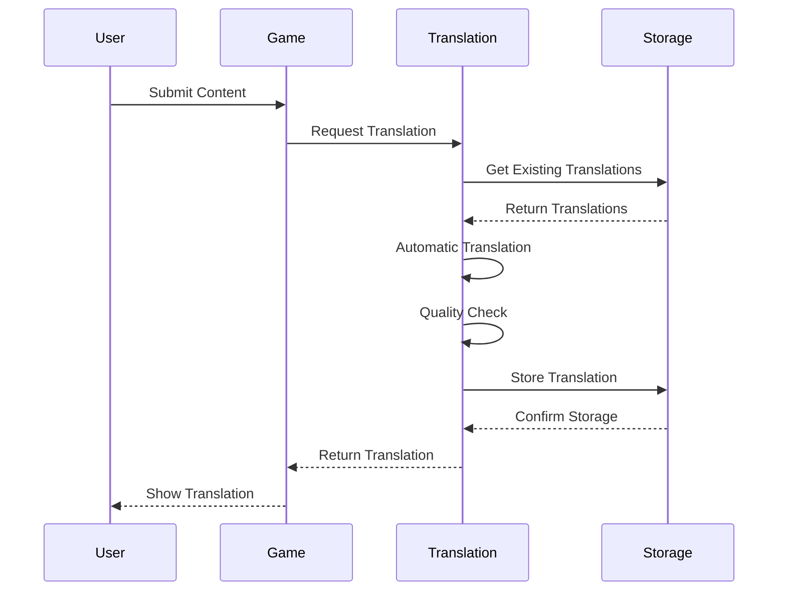
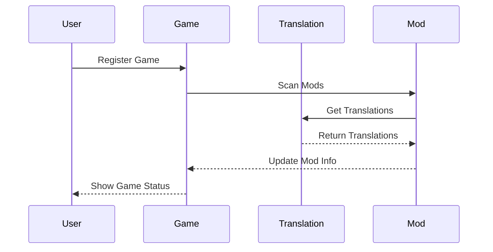

# Component Architecture

## Purpose
_Describe the component-level architecture and interactions within Project Babel._

## Scope
_This document covers component relationships, dependencies, and internal communication patterns._

## Dependencies
- [system-architecture.md](system-architecture.md)
- [database-schema.md](database-schema.md)
- [security-architecture.md](security-architecture.md)
- [code-structure.md](../development/code-structure.md)

## See Also
- [system-architecture.md](system-architecture.md) - System architecture
- [database-schema.md](database-schema.md) - Database schema
- [security-architecture.md](security-architecture.md) - Security architecture

## Overview

This document describes the component-level architecture of Project Babel, detailing how different components interact with each other and their responsibilities within the system.

## Component Relationships

## Component Structure

## Component Details

### 1. Frontend Components

#### User Interface
- React-based SPA
- Component-based architecture
- State management with Redux
- Real-time updates via Mercure

#### API Client
- Axios for HTTP requests
- Request/response interceptors
- Error handling
- Authentication management

### 2. Backend Components

#### API Controllers
- RESTful endpoints
- Request validation
- Response formatting
- Error handling
- Rate limiting

#### Services
- Business logic implementation
- Transaction management
- Event dispatching
- Cache management

#### Parsers
- File format detection
- Content extraction
- Validation
- Error handling

#### Entities
- Data models
- Relationships
- Validation rules
- Lifecycle hooks

#### Repositories
- Data access layer
- Query optimization
- Caching strategies
- Transaction management

### 3. External Components

#### Steam Workshop Integration
- API client
- Data synchronization
- Error handling
- Rate limiting

#### Cache System
- Redis implementation
- Cache strategies
- Invalidation rules
- Performance optimization

#### Database
- PostgreSQL
- Schema management
- Indexing
- Query optimization

## Component Interactions

### Data Flow

## Design Patterns

### 1. Factory Pattern
- Used in parser creation
- Allows dynamic parser selection based on file type

### 2. Strategy Pattern
- Implemented in parsers
- Enables different parsing strategies for different file formats

### 3. Repository Pattern
- Used for data access abstraction
- Provides consistent interface for database operations

### 4. Service Layer Pattern
- Separates business logic from controllers
- Provides reusable business operations

### 5. Observer Pattern
- Used for real-time updates
- Implements event-driven architecture

## Directory Structure
For detailed information about the code organization, see the [Code Structure](../development/CODE_STRUCTURE.md) documentation.

## Core Components

### Translation Component

#### Translation Manager
- Orchestrates translation workflow
- Manages translation providers
- Handles quality control
- Controls versioning

#### Automatic Translation
- Provider selection
- Translation caching
- Error handling
- Rate limiting

#### Manual Translation
- Editor interface
- Memory integration
- Glossary access
- Context viewing

#### Quality Control
- Automated checks
- Human review
- Quality metrics
- Issue tracking

#### Version Management
- History tracking
- Diff generation
- Rollback support
- Branch management

### Game Component

#### Game Manager
- Game registration
- Mod management
- File handling
- Configuration

#### Game Information
- Metadata management
- Statistics tracking
- Configuration handling
- Version control

#### Mod Management
- Mod listing
- Dependency handling
- Version control
- Compatibility checks

#### File System
- Storage management
- File synchronization
- Backup handling
- Access control

### User Component

#### User Manager
- User registration
- Profile management
- Permission control
- Activity tracking

#### Authentication
- JWT handling
- OAuth2 integration
- API key management
- Session control

#### Profile Management
- User information
- Preferences
- Statistics
- Activity history

#### Permission System
- Role management
- Access control
- Audit logging
- Policy enforcement

## Component Interactions

### Translation Flow

### Game Integration

## Dependencies

### External Dependencies
- Translation APIs
- Game APIs
- Storage Services
- Authentication Services

### Internal Dependencies
- Database Access
- Cache System
- Event System
- Message Queue

## Testing Strategy

### Unit Testing
- Component isolation
- Interface testing
- Mock dependencies
- Edge cases

### Integration Testing
- Component interaction
- API integration
- Database integration
- Cache integration

### Performance Testing
- Load testing
- Stress testing
- Scalability testing
- Resource monitoring

## Monitoring

### Metrics
- Component health
- Performance metrics
- Error rates
- Usage statistics

### Logging
- Component logs
- Error logs
- Audit logs
- Performance logs

### Alerts
- Health alerts
- Performance alerts
- Error alerts
- Security alerts

## Security

### Authentication
- Component authentication
- API authentication
- Service authentication
- Token management

### Authorization
- Access control
- Permission checks
- Resource protection
- Audit logging

### Data Protection
- Data encryption
- Secure storage
- Secure transmission
- Access logging

## Future Improvements

### Component Enhancements
- New features
- Performance optimization
- Security improvements
- Monitoring enhancements

### Integration Improvements
- New integrations
- API enhancements
- Service improvements
- Tool integration

### Testing Improvements
- Test coverage
- Test automation
- Performance testing
- Security testing
