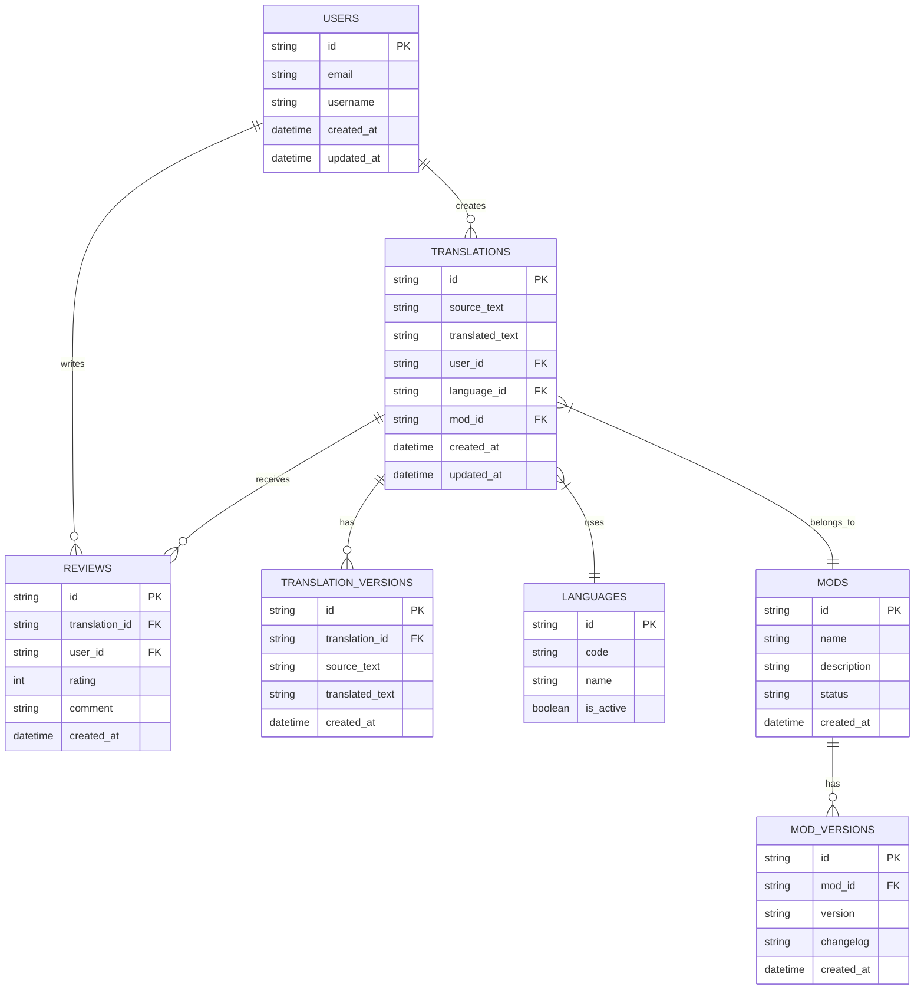

# Database Schema

## Purpose
_Describe the database schema and data model used in Project Babel._

## Scope
_This document covers database tables, relationships, and data structures._

## Dependencies
- [system-architecture.md](system-architecture.md)
- [component-architecture.md](component-architecture.md)
- [security-architecture.md](security-architecture.md)
- [translation.md](../features/translation.md)

## See Also
- [system-architecture.md](system-architecture.md) - System architecture
- [component-architecture.md](component-architecture.md) - Component architecture
- [security-architecture.md](security-architecture.md) - Security architecture

## Overview

This document describes the database schema and data model used in Project Babel, including table structures, relationships, and data integrity rules.

## Table of Contents
- [Entity Relationships](#entity-relationships)
- [Main Tables](#main-tables)
- [Indexes](#indexes)
- [Constraints](#constraints)
- [Partitioning](#partitioning)
- [Maintenance](#maintenance)
- [Backup](#backup)
- [Monitoring](#monitoring)

## Entity Relationships



## Main Tables

### 1. Users
- User information storage
- Role and permission management
- Activity tracking

### 2. Translations
- Translation storage
- Version management
- Change tracking

### 3. Mods
- Mod information
- Versions and changelogs
- Metadata

### 4. TranslationVersions
- Translation history
- Change traceability
- Version management

### 5. ModVersions
- Mod versions
- Changelogs
- Change history

### 6. Reviews
- Translation reviews
- Rating system
- Comments

## Indexes

### 1. Performance Indexes
```sql
CREATE INDEX idx_translations_user_id ON translations(user_id);
CREATE INDEX idx_translations_mod_id ON translations(mod_id);
CREATE INDEX idx_translations_status ON translations(status);
CREATE INDEX idx_mods_user_id ON mods(user_id);
CREATE INDEX idx_reviews_translation_id ON reviews(translation_id);
```

### 2. Search Indexes
```sql
CREATE INDEX idx_translations_source_text ON translations USING gin(to_tsvector('english', source_text));
CREATE INDEX idx_translations_target_text ON translations USING gin(to_tsvector('english', target_text));
CREATE INDEX idx_mods_name ON mods USING gin(to_tsvector('english', name));
```

## Constraints

### 1. Foreign Keys
```sql
ALTER TABLE translations
ADD CONSTRAINT fk_translations_user
FOREIGN KEY (user_id) REFERENCES users(id);

ALTER TABLE translations
ADD CONSTRAINT fk_translations_mod
FOREIGN KEY (mod_id) REFERENCES mods(id);

ALTER TABLE reviews
ADD CONSTRAINT fk_reviews_user
FOREIGN KEY (user_id) REFERENCES users(id);

ALTER TABLE reviews
ADD CONSTRAINT fk_reviews_translation
FOREIGN KEY (translation_id) REFERENCES translations(id);
```

### 2. Integrity Constraints
```sql
ALTER TABLE translations
ADD CONSTRAINT chk_status
CHECK (status IN ('draft', 'pending', 'approved', 'rejected'));

ALTER TABLE reviews
ADD CONSTRAINT chk_rating
CHECK (rating BETWEEN 1 AND 5);
```

## Partitioning

### 1. By Date
```sql
CREATE TABLE translations (
    id SERIAL,
    created_at TIMESTAMP NOT NULL
) PARTITION BY RANGE (created_at);

CREATE TABLE translations_y2024m01 PARTITION OF translations
    FOR VALUES FROM ('2024-01-01') TO ('2024-02-01');
```

### 2. By Language
```sql
CREATE TABLE translations (
    id SERIAL,
    target_language VARCHAR(10) NOT NULL
) PARTITION BY LIST (target_language);

CREATE TABLE translations_en PARTITION OF translations
    FOR VALUES IN ('en');
```

## Maintenance

### 1. Cleanup
```sql
-- Delete obsolete versions
DELETE FROM translation_versions
WHERE created_at < NOW() - INTERVAL '1 year';

-- Archive old translations
INSERT INTO archived_translations
SELECT * FROM translations
WHERE updated_at < NOW() - INTERVAL '2 years';
```

### 2. Optimization
```sql
-- VACUUM to free space
VACUUM ANALYZE translations;
VACUUM ANALYZE mods;

-- Update statistics
ANALYZE translations;
ANALYZE mods;
```

## Backup

### 1. Full Backup
```bash
pg_dump -Fc -v -U postgres -d project_babel > backup.dump
```

### 2. Restore
```bash
pg_restore -v -U postgres -d project_babel backup.dump
```

## Monitoring

### 1. Metrics
- Table size
- Row count
- Query time
- Index usage

### 2. Alerts
- Disk space
- Performance
- Errors
- Deadlocks 