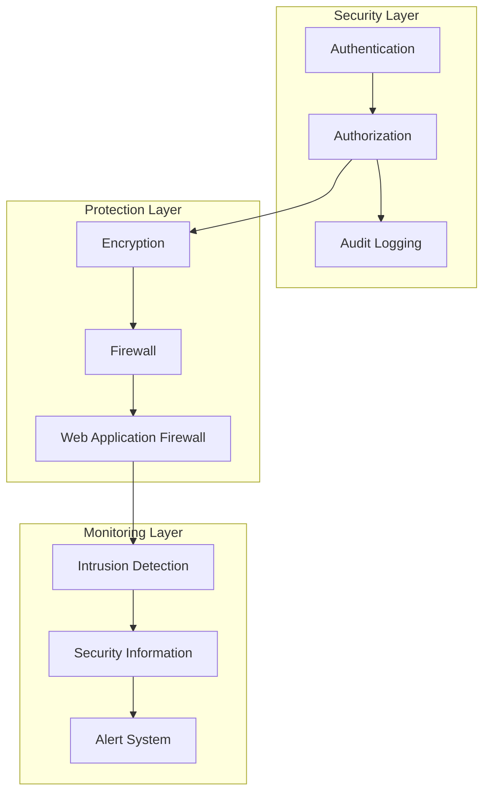
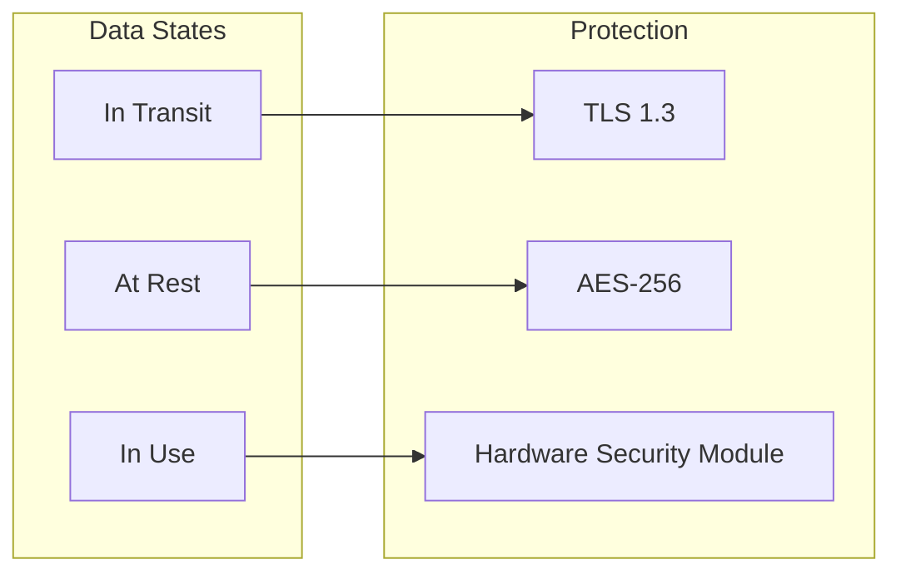

# Security Architecture

## Purpose
_Describe the security architecture and implementation in Project Babel._

## Scope
_This document covers security protocols, authentication, authorization, and data protection._

## Dependencies
- [system-architecture.md](system-architecture.md)
- [component-architecture.md](component-architecture.md)
- [database-schema.md](database-schema.md)
- [security.md](../development/security.md)
- [clients.md](clients.md)
- [../api/authentication.md](../api/authentication.md)

## See Also
- [system-architecture.md](system-architecture.md) - System security overview
- [component-architecture.md](component-architecture.md) - Security components
- [database-schema.md](database-schema.md) - Data security
- [API Clients](clients.md) - Client security and authentication
- [Authentication Guide](../api/authentication.md) - Authentication implementation

## Overview

The security architecture is designed to protect the system, its data, and users while maintaining accessibility and usability.



## Authentication

### 1. User Authentication Flows

```mermaid
graph TD
    subgraph Authentication Flows
        direction TB
        subgraph Registration
            R1[Register] --> R2[Create User]
            R2 --> R3[Generate Email Token]
            R3 --> R4[Send Verification Email]
            R4 --> R5[User Clicks Link]
            R5 --> R6[Verify Email]
        end

        subgraph Login
            L1[Login Request] --> L2[Rate Limit Check]
            L2 --> L3[Validate Credentials]
            L3 --> L4[Generate JWT]
            L3 --> L5[Generate Refresh Token]
            L4 --> L6[Return Tokens]
            L5 --> L6
        end

        subgraph Password Reset
            P1[Forgot Password] --> P2[Rate Limit Check]
            P2 --> P3[Generate Reset Token]
            P3 --> P4[Send Reset Email]
            P4 --> P5[User Clicks Link]
            P5 --> P6[Reset Password]
        end

        subgraph Token Management
            T1[Refresh Token] --> T2[Validate Token]
            T2 --> T3[Rotate Refresh Token]
            T3 --> T4[Generate New JWT]
            T3 --> T5[Revoke Old Token]
        end
    end
```


### 2. Token Types and Management
- **JWT (Short-lived)**
  - 15-minute validity
  - Contains user claims and permissions
  - Used for API authentication
  - Stored in memory only

- **Refresh Token**
  - 7-day validity
  - Stored securely in database
  - Supports rotation (new token on use)
  - Can be revoked per device

- **API Key (Planned)**
  - Long-lived service authentication
  - Scoped to specific services
  - Rate limiting per key
  - Audit logging

### 3. Rate Limiting
- **Authentication Endpoints**
  - Login: 5 attempts per minute
  - Registration: 3 attempts per hour
  - Password Reset: 3 attempts per hour
  - Email Verification: 5 attempts per hour

- **API Endpoints**
  - Per-user rate limiting
  - Per-IP rate limiting
  - Service-specific quotas
  - Burst protection

## Authorization

### 1. Access Control
- Role-Based Access Control (RBAC)
- Permission management
- Resource-based policies
- API authorization

### 2. Data Access
- Row-level security
- Column-level encryption
- Data masking
- Access logging

## Data Protection

### 1. Encryption


### 2. Key Management
- Key rotation
- Key backup
- Key recovery
- Key distribution

## Network Security

### 1. Perimeter Security
- Firewall rules
- DDoS protection
- VPN access
- Network segmentation

### 2. Application Security
- Input validation
- Output encoding
- CSRF protection
- XSS prevention

## Monitoring and Logging

### 1. Security Monitoring
- Real-time monitoring
- Threat detection
- Vulnerability scanning
- Compliance checking

### 2. Audit Logging
```sql
CREATE TABLE security_audit_logs (
    id SERIAL PRIMARY KEY,
    timestamp TIMESTAMP NOT NULL,
    user_id INTEGER,
    action VARCHAR(50) NOT NULL,
    resource VARCHAR(100),
    ip_address INET,
    user_agent TEXT,
    status VARCHAR(20),
    details JSONB
);

CREATE INDEX idx_audit_logs_timestamp ON security_audit_logs(timestamp);
CREATE INDEX idx_audit_logs_user_id ON security_audit_logs(user_id);
CREATE INDEX idx_audit_logs_action ON security_audit_logs(action);
```

## Incident Response

### 1. Detection
- Alert thresholds
- Automated detection
- Manual investigation
- False positive handling

### 2. Response
- Incident classification
- Response procedures
- Communication plan
- Recovery steps

## Compliance

### 1. Standards
- GDPR compliance
- Data protection
- Privacy requirements
- Industry standards

### 2. Auditing
- Regular audits
- Compliance reporting
- Gap analysis
- Remediation tracking

## Security Testing

### 1. Testing Types
- Penetration testing
- Vulnerability scanning
- Code security review
- Security assessment

### 2. Tools
- Static analysis
- Dynamic analysis
- Dependency scanning
- Configuration review

## Maintenance

### 1. Updates
- Security patches
- Dependency updates
- Configuration changes
- Policy updates

### 2. Documentation
- Security procedures
- Incident response
- Compliance reports
- Audit trails 