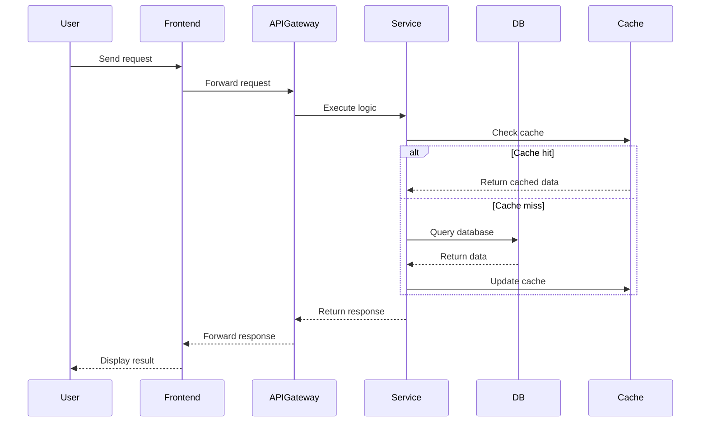
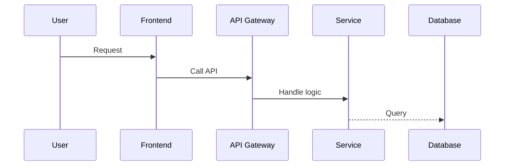
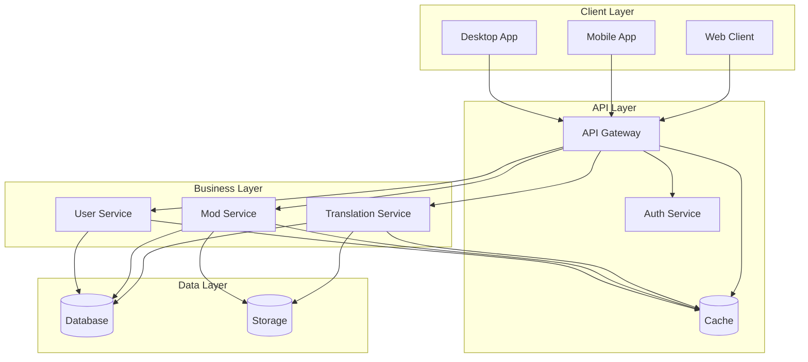
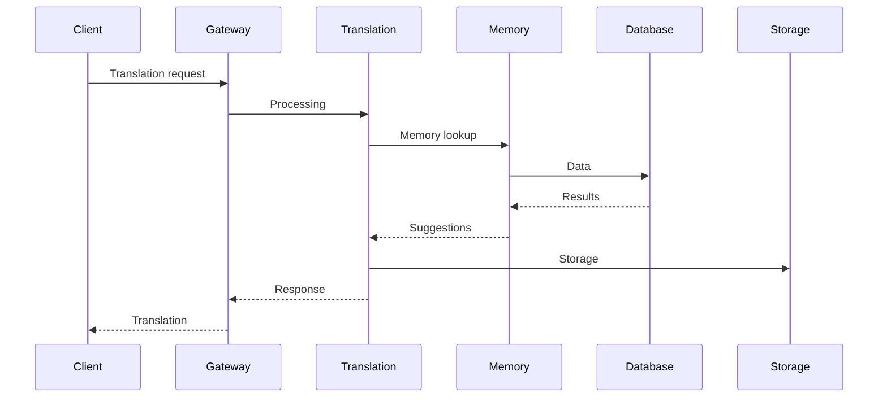
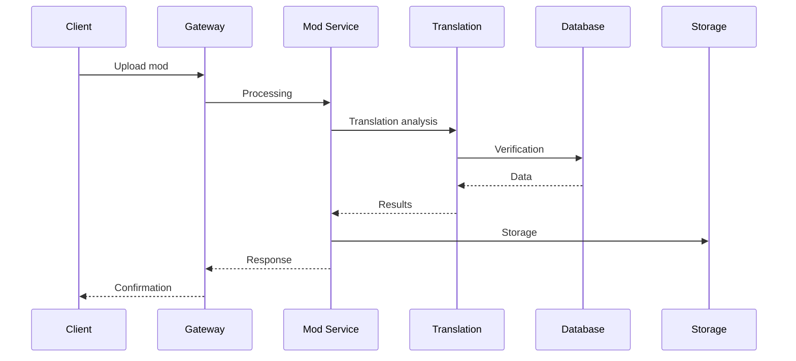

# System Architecture

## Purpose
_Describe the high-level system architecture and design principles of Project Babel._

## Scope
_This document covers system components, their interactions, and architectural decisions._

## Dependencies
- [project-overview.md](../overview/project-overview.md)
- [component-architecture.md](component-architecture.md)
- [database-schema.md](database-schema.md)
- [security-architecture.md](security-architecture.md)

## See Also
- [Project Overview](../overview/project-overview.md) - Project overview and goals
- [Component Architecture](component-architecture.md) - Detailed component design
- [Database Schema](database-schema.md) - Data model and storage
- [Security Architecture](security-architecture.md) - Security implementation
- [Deployment Guide](../development/deployment.md) - Deployment architecture

## Table of Contents
- [Overview](#overview)
- [System Flow](#system-flow)
- [System Architecture](#system-architecture)
- [Layer Architecture](#layer-architecture)
- [Data Flow](#data-flow)
- [Security](#security)
- [Performance](#performance)
- [Scalability](#scalability)
- [Maintenance](#maintenance)
- [Support](#support)

## Overview

This document provides a high-level overview of the Project Babel system architecture, including its components, their interactions, and the architectural decisions that shape the system.

## System Flow

## System Architecture

## Layer Architecture

### 1. Client Layer
- Web, mobile and desktop applications
- User interface
- Session management
- Local cache

### 2. API Layer
- Gateway for routing
- Authentication
- Rate limiting
- Validation

### 3. Business Layer
- Translation services
- Mod management
- User management
- Business logic

### 4. Data Layer
- Database
- Cache system
- File storage
- Indexing

## Data Flow

### 1. Translation Flow

### 2. Mod Management Flow

## Security

### 1. Authentication
- JWT for APIs
- OAuth2 for integrations
- API keys for services

### 2. Authorization
- RBAC (Role-Based Access Control)
- Granular permissions
- Audit logging

### 3. Data Protection
- Encryption in transit
- Encryption at rest
- Automatic backup

## Performance

### 1. Optimizations
- Multi-level cache
- Load balancing
- Database sharding
- CDN for assets

### 2. Monitoring
- Performance metrics
- Real-time alerts
- Structured logs
- Distributed tracing

## Scalability

### 1. Horizontal
- Database replication
- Cache clustering
- Load balancing
- Microservices

### 2. Vertical
- Query optimization
- Indexing
- Partitioning
- Dedicated resources

## Maintenance

### 1. Deployment
- CI/CD
- Blue/Green deployment
- Automatic rollback
- Post-deployment monitoring

### 2. Backup
- Incremental backup
- Point-in-time recovery
- Cross-region replication
- Recovery testing

## Support

### 1. Documentation
- Technical guides
- API documentation
- Troubleshooting guides
- FAQ

### 2. Monitoring
- Health dashboard
- Alerts
- Logs
- Metrics 