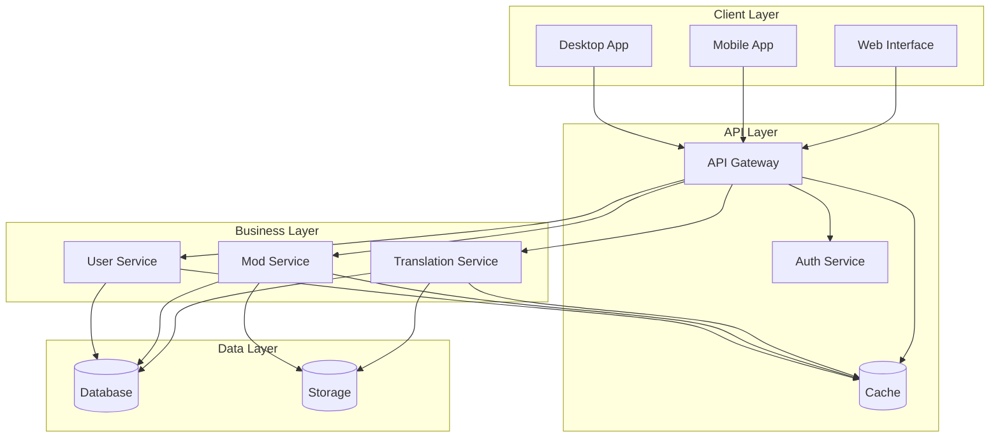

# Project Overview

## Purpose
_Provide a high-level overview of Project Babel, its goals, and key features._

## Scope
_This document covers project objectives, architecture, and main components._

## Dependencies
- [api-overview.md](../api/api-overview.md)
- [system-architecture.md](../architecture/system-architecture.md)
- [component-architecture.md](../architecture/component-architecture.md)

## See Also
- [api-overview.md](../api/api-overview.md) - API documentation
- [system-architecture.md](../architecture/system-architecture.md) - System design
- [component-architecture.md](../architecture/component-architecture.md) - Component design
- [database-schema.md](../architecture/database-schema.md) - Data model
- [security-architecture.md](../architecture/security-architecture.md) - Security design
- [getting-started.md](../development/getting-started.md) - Development setup
- [code-structure.md](../development/code-structure.md) - Code organization
- [testing.md](../development/testing.md) - Testing guidelines
- [translation.md](../features/translation.md) - Translation features
- [automatic-translation.md](../features/automatic-translation.md) - Automatic translation

# Project Babel

## 📘 Project Documentation Index

- Overview:
  - [Project Overview](docs/overview/project-overview.md)

- API:
  - [API Overview](docs/api/api-overview.md)
  - [Endpoints](docs/api/endpoints.md)
  - [Authentication](docs/api/authentication.md)
  - [Error Handling](docs/api/error-handling.md)

- Architecture:
  - [System Architecture](docs/architecture/system-architecture.md)
  - [Component Architecture](docs/architecture/component-architecture.md)
  - [Database Schema](docs/architecture/database-schema.md)
  - [Security Architecture](docs/architecture/security-architecture.md)

- Development:
  - [Getting Started](docs/development/getting-started.md)
  - [Code Structure](docs/development/code-structure.md)
  - [Testing](docs/development/testing.md)

- Features:
  - [Translation](docs/features/translation.md)
  - [Automatic Translation](docs/features/automatic-translation.md)

## Purpose
_Provide a comprehensive overview of Project Babel, its features, and its role in the translation ecosystem._

## Scope
_This document covers the high-level overview of the project, its features, and its place in the broader translation management landscape._

## Dependencies
- [System Architecture](docs/architecture/system-architecture.md)
- [Component Architecture](docs/architecture/component-architecture.md)
- [Security Architecture](docs/architecture/security-architecture.md)

## See also
- [Getting Started](docs/development/getting-started.md) - For setup instructions
- [Contributing Guide](docs/development/contributing.md) - For contribution guidelines
- [Translation Features](docs/features/translation.md) - For translation features
- [Mod Management](docs/features/mod.md) - For mod management features

## Overview

Project Babel is a powerful translation management system designed specifically for game mods and content. It provides a robust platform for managing translations, facilitating collaboration between translators, and ensuring high-quality localization across different languages.

### System Architecture


## Key Features

### 1. Translation Management
- Multi-language support
- Translation memory
- Glossary management
- Quality control workflow
- Version control
- Real-time collaboration

### 2. Mod Integration
- Mod file parsing
- Automatic translation detection
- Version tracking
- Dependency management
- Update notifications

### 3. User Management
- Role-based access control
- Team collaboration
- Activity tracking
- Profile management
- Notification system

### 4. Review System
- Quality assurance workflow
- Comment system
- Change tracking
- Approval process
- Feedback mechanism

## Technology Stack

### Backend
- PHP 8.2
- Laravel 10
- PostgreSQL 15
- Redis 7
- Elasticsearch 8
- RabbitMQ

### Frontend
- Vue.js 3
- TailwindCSS
- TypeScript
- WebSocket
- PWA support

### Infrastructure
- Docker
- Kubernetes
- Prometheus
- Grafana
- ELK Stack

## Project Structure

```
project-babel/
├── app/                    # Application code
│   ├── Http/              # HTTP layer
│   ├── Models/            # Data models
│   ├── Services/          # Business logic
│   └── Providers/         # Service providers
├── config/                # Configuration files
├── database/              # Database migrations and seeds
├── docs/                  # Documentation
├── public/                # Public assets
├── resources/             # Frontend resources
├── routes/                # Route definitions
├── storage/               # File storage
└── tests/                 # Test files
```

## Development Workflow

1. **Setup**
   - Clone repository
   - Install dependencies
   - Configure environment
   - Set up database

2. **Development**
   - Create feature branch
   - Implement changes
   - Write tests
   - Run code quality checks

3. **Review**
   - Submit pull request
   - Code review
   - Address feedback
   - Merge changes

4. **Deployment**
   - Run tests
   - Build assets
   - Deploy to staging
   - Deploy to production

## Contributing

We welcome contributions! Please see our [Contributing Guide](docs/development/contributing.md) for details on:
- Code of conduct
- Development setup
- Pull request process
- Coding standards
- Testing requirements

## Support

For support, please:
- Check the [documentation](../README.md)
- Open an issue
- Contact support: support@projectbabel.org 